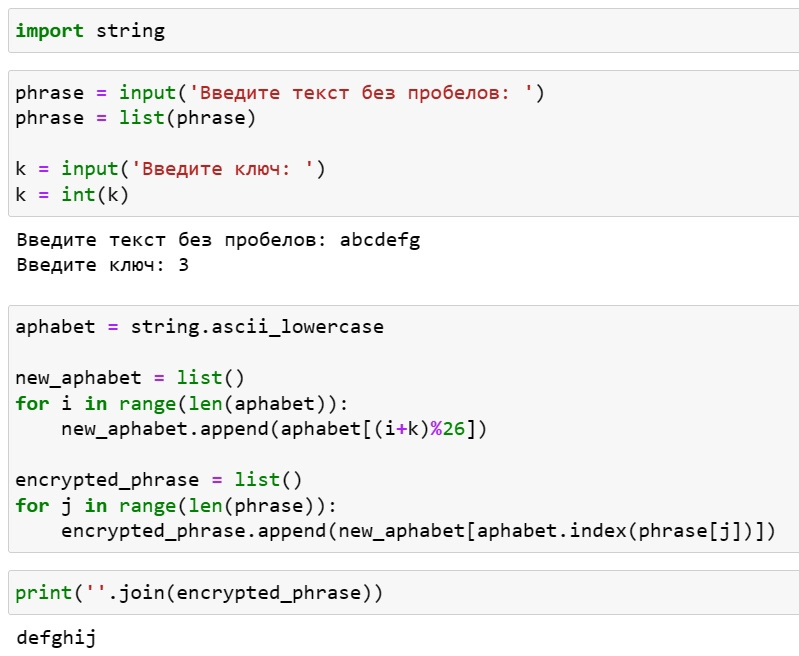
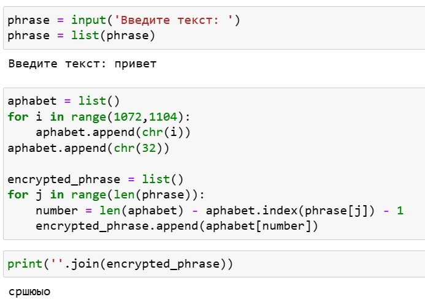

---
## Front matter
lang: ru-RU
title: Лабораторная работа №1
subtitle: Математические основы защиты информации и информационной безопасности
author:
  - Леонтьева К. А., НПМмд-02-23
institute:
  - Российский университет дружбы народов
  - Москва, Россия
date: 17 сентября 2023

## i18n babel
babel-lang: russian
babel-otherlangs: english

## Formatting pdf
toc: false
toc-title: Содержание
slide_level: 2
aspectratio: 169
section-titles: true
theme: metropolis
header-includes:
 - \metroset{progressbar=frametitle,sectionpage=progressbar,numbering=fraction}
 - '\makeatletter'
 - '\beamer@ignorenonframefalse'
 - '\makeatother'
---

## Цель лабораторной работы

1) Реализовать на языке программирования шифр Цезаря с произвольным ключом k и шифр Атбаш

## Задачи лабораторной работы
1) Изучить теоретическую часть лабораторной работы по методичке
2) Написать соответствующие программы

## Теоретическое введение

__Шифр Цезаря__ (является шифром простой замены) - это моноалфавитная подстановка, т.е. каждой букве открытого текста ставится в соответствие одна буква шифртекста. На практике при создании шифра простой замены в качестве шифроалфавита берется исходный алфавит, но с нарушенным порядком букв. 

Математически процедуру шифрования можно описать следующим образом: $T_m=\{T^j\}, j=0,1,...,m-1, T^j(a)=(a+j) mod (m)$, где $(a+j) mod (m)$ - операция нахождения остатка от целочисленного деления $a+j$ на $m$, а $T_m$ - циклическая группа.

## Теоретическое введение

__Шифр Атбаш__ является шифром сдвига на всю длину алфавита. Для реализации шифра целесообразно пользоваться таблицей ASCII и функциями работы с ней: ord и char.

Математически процедуру шифрования (для Python) можно описать следующим образом: $N - j - 1$, где N - количество букв в алфавите, j - номер заменяемой буквы в алфавите.

## Ход выполнения лабораторной работы
- Реализуем шифр Цезаря

{ #fig:001 width=50% }

## Ход выполнения лабораторной работы
- Реализуем шифр Атбаш

{ #fig:002 width=50% }

## Вывод
- В ходе выполнения данной лабораторной работы были реализованы шифры Цезаря и Атбаш на языке программирования Python

