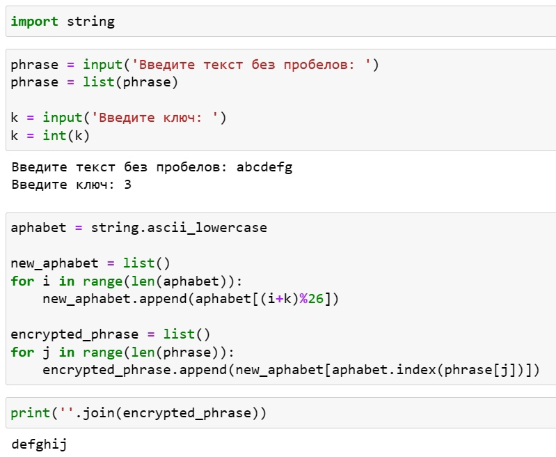
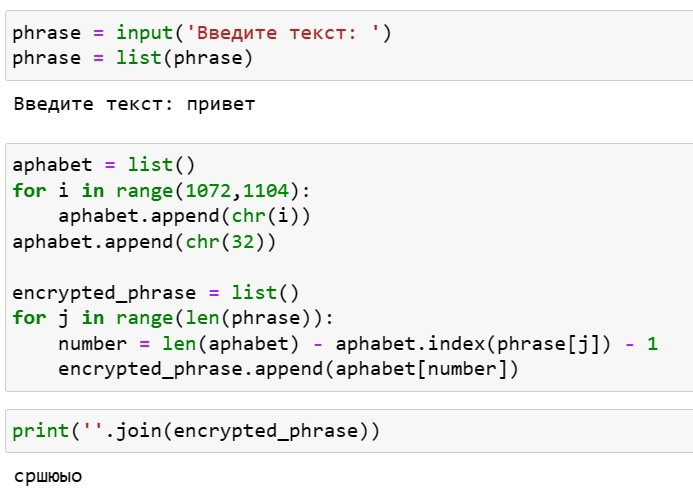

---
## Front matter
title: "Лабораторная работа №1"
subtitle: "Математические основы защиты информации и информационной безопасности"
author: "Леонтьева Ксения Андреевна | НПМмд-02-23"

## Generic otions
lang: ru-RU
toc-title: "Содержание"

## Bibliography
bibliography: bib/cite.bib
csl: pandoc/csl/gost-r-7-0-5-2008-numeric.csl

## Pdf output format
toc: true # Table of contents
toc-depth: 2
lof: true # List of figures
fontsize: 12pt
linestretch: 1.5
papersize: a4
documentclass: scrreprt
## I18n polyglossia
polyglossia-lang:
  name: russian
  options:
	- spelling=modern
	- babelshorthands=true
polyglossia-otherlangs:
  name: english
## I18n babel
babel-lang: russian
babel-otherlangs: english
## Fonts
mainfont: PT Serif
romanfont: PT Serif
sansfont: PT Sans
monofont: PT Mono
mainfontoptions: Ligatures=TeX
romanfontoptions: Ligatures=TeX
sansfontoptions: Ligatures=TeX,Scale=MatchLowercase
monofontoptions: Scale=MatchLowercase,Scale=0.9
## Biblatex
biblatex: true
biblio-style: "gost-numeric"
biblatexoptions:
  - parentracker=true
  - backend=biber
  - hyperref=auto
  - language=auto
  - autolang=other*
  - citestyle=gost-numeric
## Pandoc-crossref LaTeX customization
figureTitle: "Рис."
tableTitle: "Таблица"
listingTitle: "Листинг"
lofTitle: "Список иллюстраций"
lotTitle: "Список таблиц"
lolTitle: "Листинги"
## Misc options
indent: true
header-includes:
  - \usepackage{indentfirst}
  - \usepackage{float} # keep figures where there are in the text
  - \floatplacement{figure}{H} # keep figures where there are in the text
---

# Цель работы

Реализовать на языке программирования шифр Цезаря с произвольным ключом k и шифр Атбаш.

# Теоретическое введение

Шифр Цезаря (является шифром простой замены) - это моноалфавитная подстановка, т.е. каждой букве открытого текста ставится в соответствие одна буква шифртекста. На практике при создании шифра простой замены в качестве шифроалфавита берется исходный алфавит, но с нарушенным порядком букв (алфавитная перестановка). 

Математически процедуру шифрования можно описать следующим образом: $T_m=\{T^j\}, j=0,1,...,m-1, T^j(a)=(a+j) mod (m)$, где $(a+j) mod (m)$ - операция нахождения остатка от целочисленного деления $a+j$ на $m$, а $T_m$ - циклическая группа. Обобщение шифра Цезаря на случай произвольного ключа k для латинского алфавита: $(i+k) mod (26)$.

Шифр Атбаш является шифром сдвига на всю длину алфавита. Для реализации шифра целесообразно пользоваться таблицей ASCII и функциями работы с ней: ord и char.

Более подробно см. в [@Caesar:bash] и [@Atbash:bash].

# Выполнение лабораторной работы

Начнем с реализации шифра Цезаря. Переменные phrase и k соответствуют введенным с клавиатуры тексту и ключу, необходимому для шифрования. Переменная alphabet представляет собой список, состоящий из строчных латинских букв. New_alphabet - пустой список, который с помощью цикла мы заполняем, делая сдвиг в исходном алфавите (alphabet) на введенные k букв влево. Затем заполняем пустой список (encrypted_phrase), соответствующий зашифрованному слову. Для этого последовательно, с помощью цикла по переменной j, "берем" буквы из исходного текста (phrase), находим индекс j-той буквы из текста в исходном алфавите (alphabet), а далее в новом алфавите (new_alphabet) находим букву с найденным только что индексом. Наконец, выводим полученный зашифрованный текст на экран.

Код программы (рис. [-@fig:001]).
 
{ #fig:001 width=85% }

Далее реализовываем шифр Атбаш. Аналогично шифру Цезаря вводим текст phrase. Заполняем список alphabet русскими строчными буквами и пробелом с помощью кодов из таблицы ASCII и операции chr. Затем заполняем пустой список (encrypted_phrase), соответствующий зашифрованному слову. Для этого находим в исходном алфавите индекс, соответствующий зашифрованной букве по формуле: длина_алфавита - индекс_буквы_исходного_текста - 1. Наконец, выводим полученный зашифрованный текст на экран.

Код программы (рис. [-@fig:002]).
 
{ #fig:002 width=85% }

# Выводы

В ходе выполнения данной лабораторной работы были реализованы шифры Цезаря и Атбаш на языке программирования Python.

# Список литературы{.unnumbered}

::: {#refs}
:::
