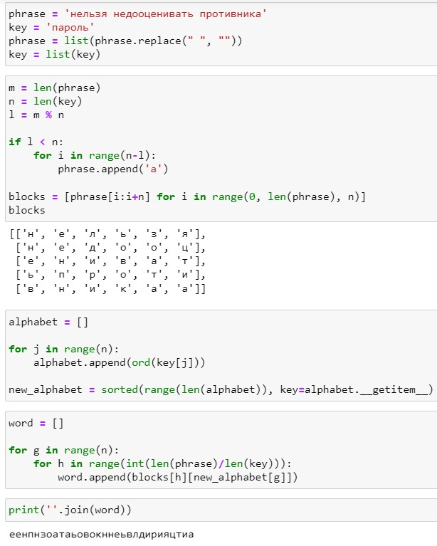
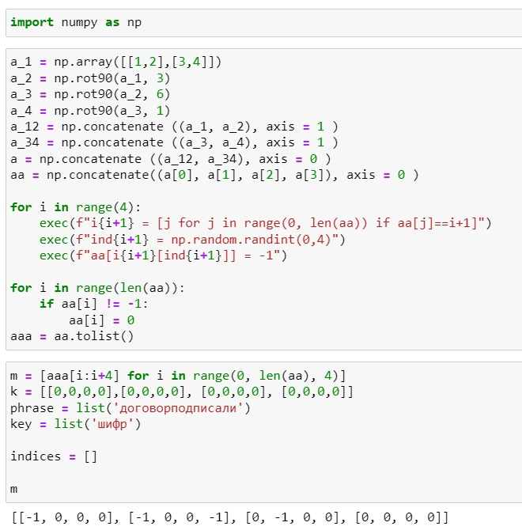
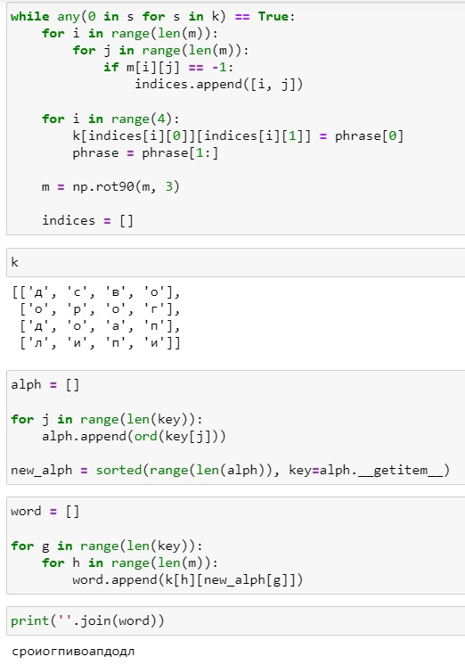
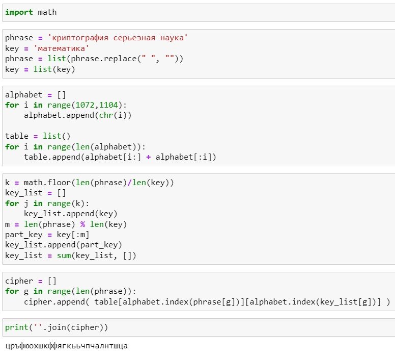

---
## Front matter
lang: ru-RU
<<<<<<< HEAD
title: Лабораторная работа №2
subtitle: Математические основы защиты информации и информационной безопасности
author:
  - Леонтьева К. А., НПМмд-02-23
institute:
  - Российский университет дружбы народов
  - Москва, Россия
date: 27 сентября 2023
=======
title: Структура научной презентации
subtitle: Простейший шаблон
author:
  - Кулябов Д. С.
institute:
  - Российский университет дружбы народов, Москва, Россия
  - Объединённый институт ядерных исследований, Дубна, Россия
date: 01 января 1970
>>>>>>> 71f447676e2b616ae0d334987b22d35fec7812b9

## i18n babel
babel-lang: russian
babel-otherlangs: english

## Formatting pdf
toc: false
toc-title: Содержание
slide_level: 2
aspectratio: 169
section-titles: true
theme: metropolis
header-includes:
 - \metroset{progressbar=frametitle,sectionpage=progressbar,numbering=fraction}
 - '\makeatletter'
 - '\beamer@ignorenonframefalse'
 - '\makeatother'
---

<<<<<<< HEAD
## Цель лабораторной работы

1) Реализовать на языке программирования маршрутное шифрование, шифрование с помощью решеток и таблицу Виженера

## Теоретическое введение
__Маршрутное шифрование__ разработал французский математик Франсуа Виет. Открытый текст записывают в некоторую геометрическую фигуру, например, прямоугольник, разбив предварительно текст на блоки, длина которых равна количеству букв в пароле. Блоки располагаются друг под другом. Затем выписывают столбцы в порядке следования букв в пароле по алфавиту.

## Теоретическое введение
__Шифрование с помощью решеток__ предложил австрийский криптограф Эдуард Флейснер в 1881 году. Формируется решетка, заполненная цифрами от 1 до 4, из которой удаляются  ячейки с разными цифрами. Затем полученная решетка накладывается на аналогичную, но пустую, и, когда заполняются все прорези буквами исходного текста по порядку их следования, решетка поворачивается на 90 градусов и вписывание букв продолжается. Далее подбирается подходящий пароль, выписываются буквы по столбцами. Очередность столбцов определяется алфавитным порядком букв пароля как в маршрутном шифровании.

## Теоретическое введение
__Шифр Виженера__ опубликовал в 1585 году французский криптограф Блез Виженер в "Трактате о шифрах". Он считался нераскрываемым до 1863 года, когда австриец Фридрих Казиски взломал его. Формируется таблица, где в строчках записаны буквы русского алфавита. При переходе от одной строке к другой происходит циклический сдвиг на одну позицию. Пароль записывается с повторениями над буквами сообщения. Далее в горизонтальном алфавите находим букву из исходного текста, в вертикальном - из пароля. На пересечении столбца и строки в таблице распологается нужная буква. 

## Ход выполнения лабораторной работы
- Реализуем маршрутное шифрование

{ #fig:001 width=35% }

## Ход выполнения лабораторной работы
- Реализуем шифрование с помощью решеток (часть 1)

{ #fig:002 width=40% }

## Ход выполнения лабораторной работы
- Реализуем шифрование с помощью решеток (часть 2)

{ #fig:003 width=30% }

## Ход выполнения лабораторной работы
- Реализуем таблицу Виженера

{ #fig:004 width=50% }

## Вывод
- В ходе выполнения данной лабораторной работы были реализованы маршрутное шифрование, шифрование с помощью решеток и таблица Виженера


=======
# Информация

## Докладчик

:::::::::::::: {.columns align=center}
::: {.column width="70%"}

  * Кулябов Дмитрий Сергеевич
  * д.ф.-м.н., профессор
  * профессор кафедры прикладной информатики и теории вероятностей
  * Российский университет дружбы народов
  * [kulyabov-ds@rudn.ru](mailto:kulyabov-ds@rudn.ru)
  * <https://yamadharma.github.io/ru/>

:::
::: {.column width="30%"}


:::
::::::::::::::

# Вводная часть

## Актуальность

- Важно донести результаты своих исследований до окружающих
- Научная презентация --- рабочий инструмент исследователя
- Необходимо создавать презентацию быстро
- Желательна минимизация усилий для создания презентации

## Объект и предмет исследования

- Презентация как текст
- Программное обеспечение для создания презентаций
- Входные и выходные форматы презентаций

## Цели и задачи

- Создать шаблон презентации в Markdown
- Описать алгоритм создания выходных форматов презентаций

## Материалы и методы

- Процессор `pandoc` для входного формата Markdown
- Результирующие форматы
	- `pdf`
	- `html`
- Автоматизация процесса создания: `Makefile`

# Создание презентации

## Процессор `pandoc`

- Pandoc: преобразователь текстовых файлов
- Сайт: <https://pandoc.org/>
- Репозиторий: <https://github.com/jgm/pandoc>

## Формат `pdf`

- Использование LaTeX
- Пакет для презентации: [beamer](https://ctan.org/pkg/beamer)
- Тема оформления: `metropolis`

## Код для формата `pdf`

```yaml
slide_level: 2
aspectratio: 169
section-titles: true
theme: metropolis
```

## Формат `html`

- Используется фреймворк [reveal.js](https://revealjs.com/)
- Используется [тема](https://revealjs.com/themes/) `beige`

## Код для формата `html`

- Тема задаётся в файле `Makefile`

```make
REVEALJS_THEME = beige 
```
# Результаты

## Получающиеся форматы

- Полученный `pdf`-файл можно демонстрировать в любой программе просмотра `pdf`
- Полученный `html`-файл содержит в себе все ресурсы: изображения, css, скрипты

# Элементы презентации

## Актуальность

- Даёт понять, о чём пойдёт речь
- Следует широко и кратко описать проблему
- Мотивировать свое исследование
- Сформулировать цели и задачи
- Возможна формулировка ожидаемых результатов

## Цели и задачи

- Не формулируйте более 1--2 целей исследования

## Материалы и методы

- Представляйте данные качественно
- Количественно, только если крайне необходимо
- Излишние детали не нужны

## Содержание исследования

- Предлагаемое решение задач исследования с обоснованием
- Основные этапы работы

## Результаты

- Не нужны все результаты
- Необходимы логические связки между слайдами
- Необходимо показать понимание материала


## Итоговый слайд

- Запоминается последняя фраза. © Штирлиц
- Главное сообщение, которое вы хотите донести до слушателей
- Избегайте использовать последний слайд вида *Спасибо за внимание*

# Рекомендации

## Принцип 10/20/30

  - 10 слайдов
  - 20 минут на доклад
  - 30 кегль шрифта

## Связь слайдов

::: incremental

- Один слайд --- одна мысль
- Нельзя ссылаться на объекты, находящиеся на предыдущих слайдах (например, на формулы)
- Каждый слайд должен иметь заголовок

:::

## Количество сущностей

::: incremental

- Человек может одновременно помнить $7 \pm 2$ элемента
- При размещении информации на слайде старайтесь чтобы в сумме слайд содержал не более 5 элементов
- Можно группировать элементы так, чтобы визуально было не более 5 групп

:::

## Общие рекомендации

::: incremental

- На слайд выносится та информация, которая без зрительной опоры воспринимается хуже
- Слайды должны дополнять или обобщать содержание выступления или его частей, а не дублировать его
- Информация на слайдах должна быть изложена кратко, чётко и хорошо структурирована
- Слайд не должен быть перегружен графическими изображениями и текстом
- Не злоупотребляйте анимацией и переходами

:::

## Представление данных

::: incremental

- Лучше представить в виде схемы
- Менее оптимально представить в виде рисунка, графика, таблицы
- Текст используется, если все предыдущие способы отображения информации не подошли

:::
>>>>>>> 71f447676e2b616ae0d334987b22d35fec7812b9

