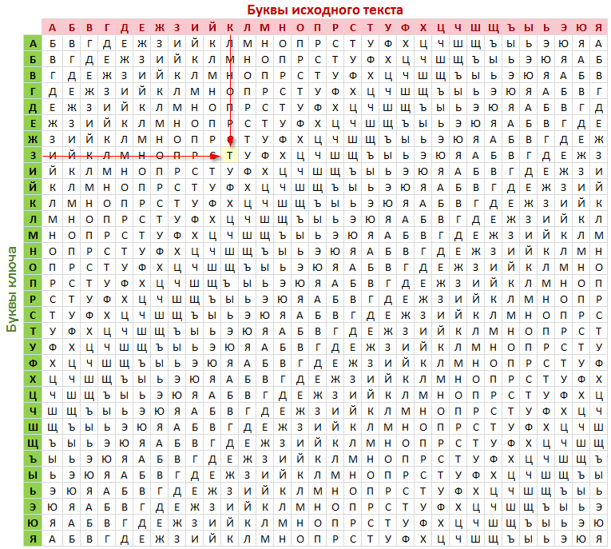
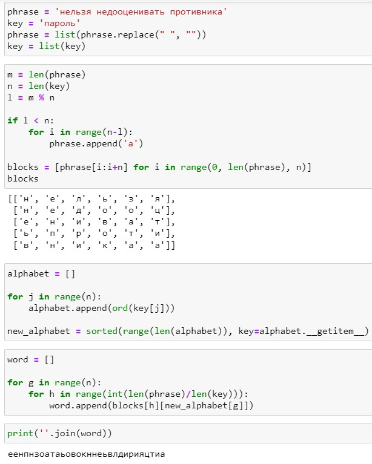
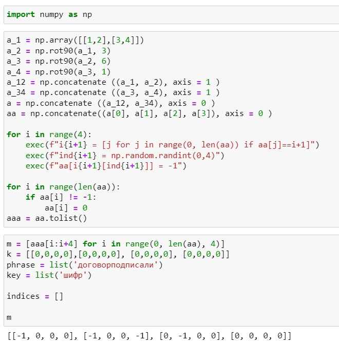
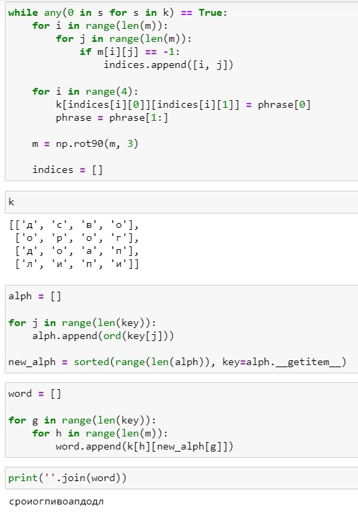
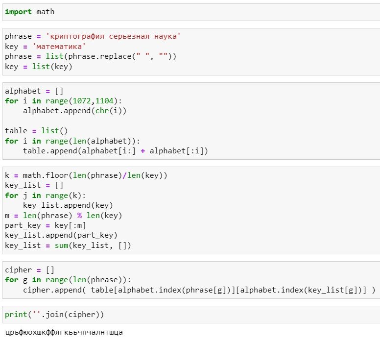

---
## Front matter
<<<<<<< HEAD
title: "Лабораторная работа №2"
subtitle: "Математические основы защиты информации и информационной безопасности"
author: "Леонтьева Ксения Андреевна | НПМмд-02-23"
=======
title: "Шаблон отчёта по лабораторной работе"
subtitle: "Простейший вариант"
author: "Дмитрий Сергеевич Кулябов"
>>>>>>> 71f447676e2b616ae0d334987b22d35fec7812b9

## Generic otions
lang: ru-RU
toc-title: "Содержание"

## Bibliography
bibliography: bib/cite.bib
csl: pandoc/csl/gost-r-7-0-5-2008-numeric.csl

## Pdf output format
toc: true # Table of contents
toc-depth: 2
lof: true # List of figures
<<<<<<< HEAD
=======
lot: true # List of tables
>>>>>>> 71f447676e2b616ae0d334987b22d35fec7812b9
fontsize: 12pt
linestretch: 1.5
papersize: a4
documentclass: scrreprt
## I18n polyglossia
polyglossia-lang:
  name: russian
  options:
	- spelling=modern
	- babelshorthands=true
polyglossia-otherlangs:
  name: english
## I18n babel
babel-lang: russian
babel-otherlangs: english
## Fonts
mainfont: PT Serif
romanfont: PT Serif
sansfont: PT Sans
monofont: PT Mono
mainfontoptions: Ligatures=TeX
romanfontoptions: Ligatures=TeX
sansfontoptions: Ligatures=TeX,Scale=MatchLowercase
monofontoptions: Scale=MatchLowercase,Scale=0.9
## Biblatex
biblatex: true
biblio-style: "gost-numeric"
biblatexoptions:
  - parentracker=true
  - backend=biber
  - hyperref=auto
  - language=auto
  - autolang=other*
  - citestyle=gost-numeric
## Pandoc-crossref LaTeX customization
figureTitle: "Рис."
tableTitle: "Таблица"
listingTitle: "Листинг"
lofTitle: "Список иллюстраций"
lotTitle: "Список таблиц"
lolTitle: "Листинги"
## Misc options
indent: true
header-includes:
  - \usepackage{indentfirst}
  - \usepackage{float} # keep figures where there are in the text
  - \floatplacement{figure}{H} # keep figures where there are in the text
---

# Цель работы

<<<<<<< HEAD
Реализовать на языке программирования маршрутное шифрование, шифрование с помощью решеток и таблицу Виженера.

# Теоретическое введение

__Шифры перестановки__ преобразуют открытый текст в криптограмму путем перестановки его символов.

__Маршрутное шифрование__ разработал французский математик Франсуа Виет. Открытый текст записывают в некоторую геометрическую фигуру, например, прямоугольник, разбив предварительно текст на блоки, длина которых равна количеству букв в пароле (при необходимости дописывают произвольные буквы для достижения нужного количества). Блоки располагаются друг под другом. Затем выписывают столбцы в порядке следования букв в пароле по алфавиту (пароль записывается под прямоугольником).

Более подробно см. в [@Link1:bash].

__Шифрование с помощью решеток__ предложил австрийский криптограф Эдуард Флейснер в 1881 году. Формируется решетка, заполненная цифрами от 1 до 4, из которой удаляются некоторые ячейки так, чтобы при последовательных поворотах этой решетки на 90 градусов и записи букв в удаленные ячейки буквы не накладывались друг на друга и можно было записать весь текст (в идеальном случае $k^2=N$, где $k^2$ - длина стороны квадрата решетки, а $N$ - количество букв в исходном тексте). Затем полученная решетка накладывается на аналогичную, но пустую, и, когда заполняются все прорези буквами исходного текста по порядку их следования, решетка поворачивается на 90 градусов и вписывание букв продолжается. Далее подбирается подходящий пароль (число букв пароля должно равняться $k^2$ и они не должны повторяться), выписываются буквы по столбцами. Очередность столбцов определяется алфавитным порядком букв пароля как в маршрутном шифровании.

Более подробно см. в [@Link2:bash].

__Шифр Виженера__ опубликовал в 1585 году французский криптограф Блез Виженер в "Трактате о шифрах". Он считался нераскрываемым до 1863 года, когда австриец Фридрих Казиски взломал его. Опишем одну из схем построения данного шифра. Формируется таблица, где в строчках записаны буквы русского алфавита (рис. [-@fig:001]). При переходе от одной строке к другой происходит циклический сдвиг на одну позицию. Пароль же записывается с повторениями над буквами сообщения. Далее в горизонтальном алфавите находим букву из исходного текста, в вертикальном - из пароля. На пересечении столбца и строки в таблице распологается нужная буква. Продолжаем так с остальными буквами.

Более подробно см. в [@Link3:bash].

{ #fig:001 width=85% }

# Выполнение лабораторной работы

Начнем с реализации маршрутного шифрования. Переменные phrase и key содержат открытый текст и пароль соответственно. Проверим необходимость добавления в открытый текст дополнительных букв, чтобы текст можно было разбить на равные блоки. Если остаток от деления количества символов в открытом тексте на количество символов в пароле меньше количества символов в пароле, то добавляем в конец текста нужное количество букв. Список block представляет собой список, состоящий из блоков, на которые мы разбили наш открытый текст. Размер каждого блока соответствует количеству символов в пароле.

В список alphabet внесем коды ASCII для букв в пароле. Затем в список new_alphabet внесем индексы букв из пароля в алфавитном порядке. Список word представляет собой зашифрованную последовательность: сначала выбираем индекс буквы в подсписке blocks в соответствии с алфавитным порядком букв в пароле, а затем выписываем буквы с таким индексом последовательно из каждого подсписка. Наконец, выводим полученную последовательность.
 
Код программы (рис. [-@fig:002]).
 
{ #fig:002 width=85% }

В шифровании с помощью решеток начнем с создания решетки, которая впоследствии будет накладываться на пустую для заполнения. Создаем начальный массив a_1 и поворачиваем его три раза подряд на 90 градусов. Затем объединяем соответствующие полученные массивы, чтобы получить решетку 4x4. Далее запоминаем в переменные i\_1, i\_2, i\_3, i\_4 индексы цифр 1, 2, 3, 4 и, выбрав, для каждой цифры произвольный индекс, заменяем ее на -1 ("удаляем"). Оставшиеся цифры для удобства заменяем на 0. Делим полученный массив на блоки по 4 цифры в каждом для дальнейшей работы.

Переменная m содержит полученный разделенный на блоки массив, переменная k - пустой список, куда будут записываться буквы. В phrase и key записываем исходный текст и пароль. В indices сохраняем индексы из m, на месте которых стоят -1. Пока список k не будет заполнен полностью повторяем алгоритм: сохраняем текущие индексы с -1 в indices, далее на место этих -1 записываем последовательно буквы из phrase, удаляя после записи каждой буквы ее из phrase, поворачиваем решетку m на 90 градусов, список indices делаем пустым для дальнейшего заполнения. Выводим итоговую табличку k.

Далее код представляет собой аналогичный маршрутному шифрованию и вывод зашифрованного текста.

Код программы (рис. [-@fig:003] и рис. [-@fig:004]).
 
{ #fig:003 width=85% }

{ #fig:004 width=78% } 

В шифре Виженера аналогично в переменные phrase и key записываем исходную последовательность и пароль. В alphabet - русский алфавит без буквы "ё". Создаем таблицу (table) из повторения алфавита со сдвигом на одну позицию влево, так называемую таблицу Виженера. В k вычисляем количество повторений пароля целиком и записываем его k раз в key_list. На оставшиеся свободные места (длина key\_list равна длине исходной фразы) дописываем только часть пароля. Далее печатаем зашифрованную последовательность следующим образом: из таблицы выбираем строку с буквой из исходной фразы phrase и столбец с буквой из key\_list. С помощью цикла последовательно проходимся по соответствующим спискам. Выводим полученную последовательность.

Код программы (рис. [-@fig:005]).

{ #fig:005 width=90% }

# Выводы

В ходе выполнения данной лабораторной работы были реализованы маршрутное шифрование, шифрование с помощью решеток и таблица Виженера.
=======
Здесь приводится формулировка цели лабораторной работы. Формулировки
цели для каждой лабораторной работы приведены в методических
указаниях.

Цель данного шаблона --- максимально упростить подготовку отчётов по
лабораторным работам.  Модифицируя данный шаблон, студенты смогут без
труда подготовить отчёт по лабораторным работам, а также познакомиться
с основными возможностями разметки Markdown.

# Задание

Здесь приводится описание задания в соответствии с рекомендациями
методического пособия и выданным вариантом.

# Теоретическое введение

Здесь описываются теоретические аспекты, связанные с выполнением работы.

Например, в табл. @tbl:std-dir приведено краткое описание стандартных каталогов Unix.

: Описание некоторых каталогов файловой системы GNU Linux {#tbl:std-dir}

| Имя каталога | Описание каталога                                                                                                          |
|--------------|----------------------------------------------------------------------------------------------------------------------------|
| `/`          | Корневая директория, содержащая всю файловую                                                                               |
| `/bin `      | Основные системные утилиты, необходимые как в однопользовательском режиме, так и при обычной работе всем пользователям     |
| `/etc`       | Общесистемные конфигурационные файлы и файлы конфигурации установленных программ                                           |
| `/home`      | Содержит домашние директории пользователей, которые, в свою очередь, содержат персональные настройки и данные пользователя |
| `/media`     | Точки монтирования для сменных носителей                                                                                   |
| `/root`      | Домашняя директория пользователя  `root`                                                                                   |
| `/tmp`       | Временные файлы                                                                                                            |
| `/usr`       | Вторичная иерархия для данных пользователя                                                                                 |

Более подробно об Unix см. в [@gnu-doc:bash;@newham:2005:bash;@zarrelli:2017:bash;@robbins:2013:bash;@tannenbaum:arch-pc:ru;@tannenbaum:modern-os:ru].

# Выполнение лабораторной работы

Описываются проведённые действия, в качестве иллюстрации даётся ссылка на иллюстрацию (рис. @fig:001).

{#fig:001 width=70%}

# Выводы

Здесь кратко описываются итоги проделанной работы.
>>>>>>> 71f447676e2b616ae0d334987b22d35fec7812b9

# Список литературы{.unnumbered}

::: {#refs}
:::
