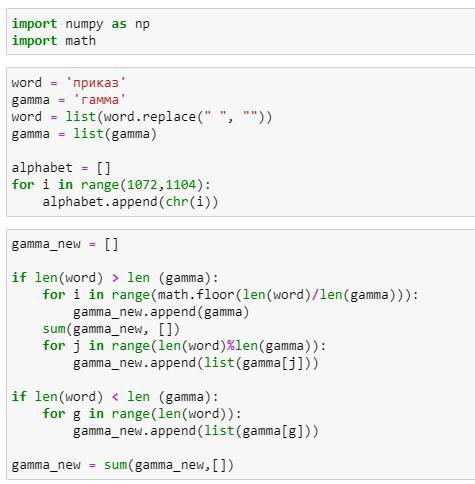
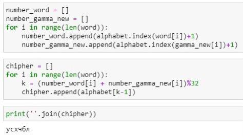

---
## Front matter
lang: ru-RU
title: Лабораторная работа №3
subtitle: Математические основы защиты информации и информационной безопасности
author:
  - Леонтьева К. А., НПМмд-02-23
institute:
  - Российский университет дружбы народов
  - Москва, Россия
date: 9 октября 2023

## i18n babel
babel-lang: russian
babel-otherlangs: english

## Formatting pdf
toc: false
toc-title: Содержание
slide_level: 2
aspectratio: 169
section-titles: true
theme: metropolis
header-includes:
 - \metroset{progressbar=frametitle,sectionpage=progressbar,numbering=fraction}
 - '\makeatletter'
 - '\beamer@ignorenonframefalse'
 - '\makeatother'
---

## Цель лабораторной работы

1) Реализовать на языке программирования шифрование гаммированием конечной гаммой

## Задачи лабораторной работы
1) Изучить теоретическую часть лабораторной работы по методичке
2) Написать соответствующую программу

## Теоретическое введение

__Гаммирование__ - процедура наложения при помощи некоторой функции F на исходный текст гаммы шифра, то есть псевдослучайной последовательности (ПСП) с выходов генератора G. Чаще всего в качестве функции F берется операция поразрядного сложения по модулю два или по модулю N (N - число букв алфавита открытого текста).

Простейший генератор ПСП можно представить рекуррентным соотношением: $$\gamma_i = (a \gamma_{i-1} + b) mod(m), i=1,...,m,$$ где $\gamma_i$ - i-й член последовательности псевдослучайных чисел, $a, \gamma_0, b$ - ключевые параметры.

## Ход выполнения лабораторной работы
- Реализуем шифрование гаммированием с конечной гаммой

{ #fig:001 width=43% }

## Ход выполнения лабораторной работы

{ #fig:002 width=43% }

## Вывод
- В ходе выполнения данной лабораторной работы было реализовано шифрование гаммированием конечной гаммой на языке программирования Python

