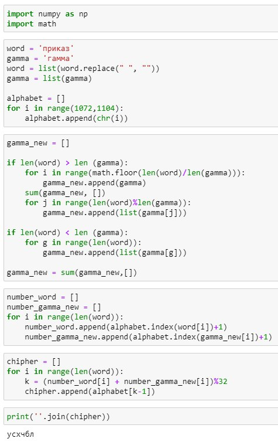

---
## Front matter
title: "Лабораторная работа №3"
subtitle: "Математические основы защиты информации и информационной безопасности"
author: "Леонтьева Ксения Андреевна | НПМмд-02-23"

## Generic otions
lang: ru-RU
toc-title: "Содержание"

## Bibliography
bibliography: bib/cite.bib
csl: pandoc/csl/gost-r-7-0-5-2008-numeric.csl

## Pdf output format
toc: true # Table of contents
toc-depth: 2
lof: true # List of figures
fontsize: 12pt
linestretch: 1.5
papersize: a4
documentclass: scrreprt
## I18n polyglossia
polyglossia-lang:
  name: russian
  options:
	- spelling=modern
	- babelshorthands=true
polyglossia-otherlangs:
  name: english
## I18n babel
babel-lang: russian
babel-otherlangs: english
## Fonts
mainfont: PT Serif
romanfont: PT Serif
sansfont: PT Sans
monofont: PT Mono
mainfontoptions: Ligatures=TeX
romanfontoptions: Ligatures=TeX
sansfontoptions: Ligatures=TeX,Scale=MatchLowercase
monofontoptions: Scale=MatchLowercase,Scale=0.9
## Biblatex
biblatex: true
biblio-style: "gost-numeric"
biblatexoptions:
  - parentracker=true
  - backend=biber
  - hyperref=auto
  - language=auto
  - autolang=other*
  - citestyle=gost-numeric
## Pandoc-crossref LaTeX customization
figureTitle: "Рис."
tableTitle: "Таблица"
listingTitle: "Листинг"
lofTitle: "Список иллюстраций"
lotTitle: "Список таблиц"
lolTitle: "Листинги"
## Misc options
indent: true
header-includes:
  - \usepackage{indentfirst}
  - \usepackage{float} # keep figures where there are in the text
  - \floatplacement{figure}{H} # keep figures where there are in the text
---

# Цель работы

Реализовать на языке программирования шифрование гаммированием конечной гаммой.

# Теоретическое введение

__Гаммирование__ - процедура наложения при помощи некоторой функции F на исходный текст гаммы шифра, то есть псевдослучайной последовательности (ПСП) с выходов генератора G. ПСП по своим статистическим свойствам неотличима от случайной последовательности, но является детерминированной, то есть известен алгоритм ее формирования. Чаще всего в качестве функции F берется операция поразрядного сложения по модулю два или по модулю N (N - число букв алфавита открытого текста).

Простейший генератор ПСП можно представить рекуррентным соотношением: $$\gamma_i = (a \gamma_{i-1} + b) mod(m), i=1,...,m,$$ где $\gamma_i$ - i-й член последовательности псевдослучайных чисел, $a, \gamma_0, b$ - ключевые параметры. Отметим, что ПСП является периодической. 

Стойкость шифров, основанных на процедуре гаммирования, зависит от характеристик гаммы - длины и равномерности распределения вероятностей появления знаков гаммы.

Более подробно см. в [@Gamma:bash]. 

# Выполнение лабораторной работы

Списки word и gamma содержат шифруемое слово и гамму соответственно. Список alphabet заполняем буквами русского алфавита без "ё". Далее сравниваем размерности word и gamma и если количество букв в word больше количества букв в gamma, то в список gamma_new записываем подряд gamma столько раз, сколько оно целиком входит по количеству букв в word, а затем оставшуюся часть gamma, чтобы сравнять размерности. Если же количество букв в word меньше количества букв в gamma, то в gamma\_new из gamma записывается столько букв, сколько их содержится в word. Затем в списки number\_word и number\_gamma\_new записываем номера соответствующих букв из нашего алфавита. i-я буква зашифрованного слова получается по формуле: $(number\_word[i] + number\_gamma\_new[i]) mod 32$, поскольку в нашем алфавите без "ё" 32 буквы. Наконец, выводим результат на экран.

Код программы (рис. [-@fig:001]).
 
{ #fig:001 width=75% }

# Выводы

В ходе выполнения данной лабораторной работы было реализовано шифрование гаммированием конечной гаммой на языке программирования Python.

# Список литературы{.unnumbered}

::: {#refs}
:::
