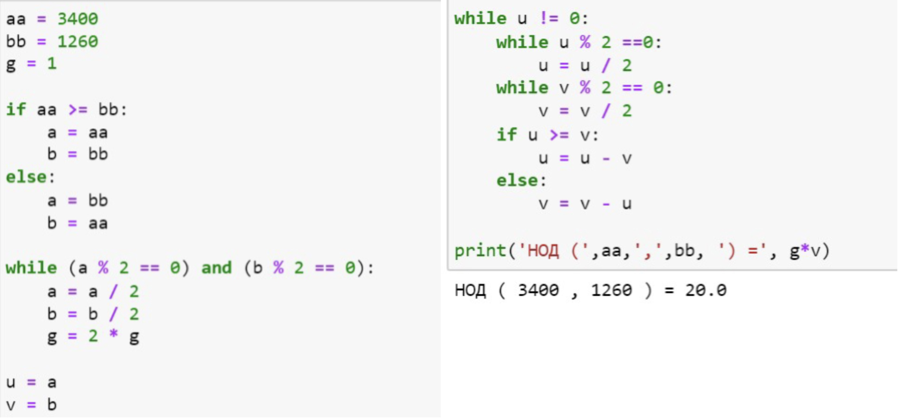

---
## Front matter
lang: ru-RU
title: Лабораторная работа №4
subtitle: Математические основы защиты информации и информационной безопасности
author:
  - Леонтьева К. А., НПМмд-02-23
institute:
  - Российский университет дружбы народов
  - Москва, Россия
date: 14 октября 2023

## i18n babel
babel-lang: russian
babel-otherlangs: english

## Formatting pdf
toc: false
toc-title: Содержание
slide_level: 2
aspectratio: 169
section-titles: true
theme: metropolis
header-includes:
 - \metroset{progressbar=frametitle,sectionpage=progressbar,numbering=fraction}
 - '\makeatletter'
 - '\beamer@ignorenonframefalse'
 - '\makeatother' 
---

## Цель лабораторной работы

1) Реализовать на языке программирования алгоритмы Евклида для вычисления наибольшего общего делителя

## Теоретическое введение

Целое число $d \neq 0$ называется __наибольшим общим делителем__ целых чисел $a_1, a_2, ..., a_k$ (обозначается $d =$ НОД $(a_1, a_2, ..., a_k)$), если выполняются следующие условия:

* каждое из чисел $a_1, a_2, ..., a_k$ делится на $d$,

* если $d_1 \neq 0$ - другой общий делитель чисел $a_1, a_2, ..., a_k$, то $d$ делится на $d_1$.

Для вычисления наибольшего общего делителя двух целых чисел применяется способ повторного деления с остатком, называемый __алгоритмом Евклида__.

## Теоретическое введение

__Бинарный алгоритм Евклида__ основан на следующих свойствах наибольшего общего делителя (считаем, что $0 < b \leq a$):

1. если оба числа $a$ и $b$ четные, то НОД$(a,b)=2 *$ НОД$(\frac {a}{2}, \frac{b}{2})$

2. если число $a$ - нечетное, число $b$ -четное, то НОД$(a,b)=$ НОД$(a, \frac{b}{2})$

3. если оба числа $a$ и $b$ нечетные, $a>b$, то НОД$(a,b)=$ НОД$(a-b,b)$

4. если $a=b$, то НОД$(a,b)=a$

## Ход выполнения лабораторной работы
- Реализуем алгоритм Евклида

{ #fig:001 width=35% }

## Ход выполнения лабораторной работы

- Реализуем бинарный алгоритм Евклида

{ #fig:002 width=60% }

## Ход выполнения лабораторной работы

- Реализуем расширенный алгоритм Евклида

{ #fig:003 width=60% }

## Ход выполнения лабораторной работы 

- Реализуем расширенный бинарный алгоритм Евклида

{ #fig:004 width=60% }

## Вывод
- В ходе выполнения данной лабораторной работы были реализованы алгоритмы Евклида для вычисления наибольшего общего делителя

