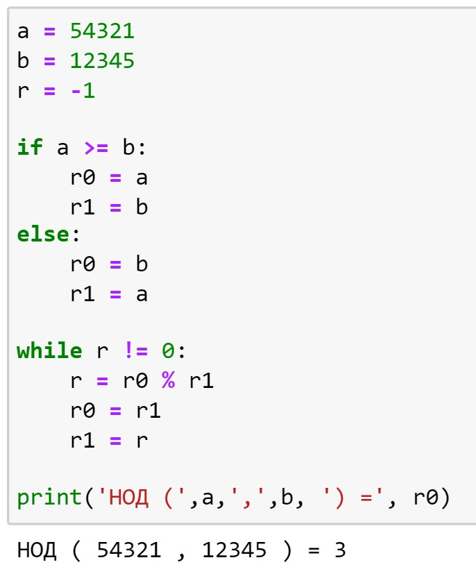
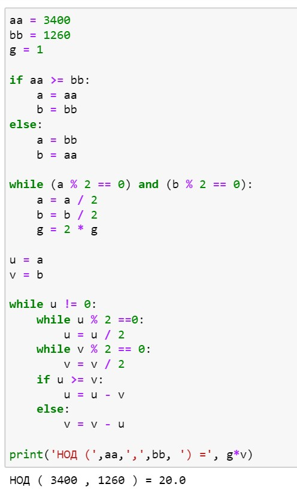
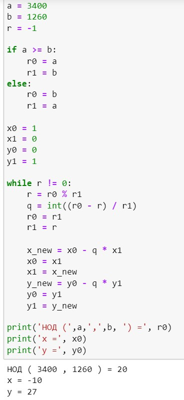
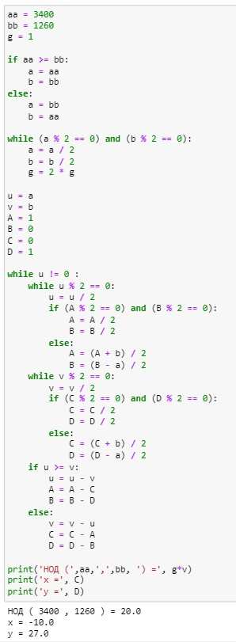

---
## Front matter
title: "Лабораторная работа №4"
subtitle: "Математические основы защиты информации и информационной безопасности"
author: "Леонтьева Ксения Андреевна | НПМмд-02-23"

## Generic otions
lang: ru-RU
toc-title: "Содержание"

## Bibliography
bibliography: bib/cite.bib
csl: pandoc/csl/gost-r-7-0-5-2008-numeric.csl

## Pdf output format
toc: true # Table of contents
toc-depth: 2
lof: true # List of figures
fontsize: 12pt
linestretch: 1.5
papersize: a4
documentclass: scrreprt
## I18n polyglossia
polyglossia-lang:
  name: russian
  options:
	- spelling=modern
	- babelshorthands=true
polyglossia-otherlangs:
  name: english
## I18n babel
babel-lang: russian
babel-otherlangs: english
## Fonts
mainfont: PT Serif
romanfont: PT Serif
sansfont: PT Sans
monofont: PT Mono
mainfontoptions: Ligatures=TeX
romanfontoptions: Ligatures=TeX
sansfontoptions: Ligatures=TeX,Scale=MatchLowercase
monofontoptions: Scale=MatchLowercase,Scale=0.9
## Biblatex
biblatex: true
biblio-style: "gost-numeric"
biblatexoptions:
  - parentracker=true
  - backend=biber
  - hyperref=auto
  - language=auto
  - autolang=other*
  - citestyle=gost-numeric
## Pandoc-crossref LaTeX customization
figureTitle: "Рис."
tableTitle: "Таблица"
listingTitle: "Листинг"
lofTitle: "Список иллюстраций"
lotTitle: "Список таблиц"
lolTitle: "Листинги"
## Misc options
indent: true
header-includes:
  - \usepackage{indentfirst}
  - \usepackage{float} # keep figures where there are in the text
  - \floatplacement{figure}{H} # keep figures where there are in the text
---

# Цель работы

Реализовать на языке программирования алгоритмы Евклида для вычисления наибольшего общего делителя.

# Теоретическое введение

Целое число $d \neq 0$ называется __наибольшим общим делителем__ целых чисел $a_1, a_2, ..., a_k$ (обозначается $d =$ НОД $(a_1, a_2, ..., a_k)$), если выполняются следующие условия:

* каждое из чисел $a_1, a_2, ..., a_k$ делится на $d$,

* если $d_1 \neq 0$ - другой общий делитель чисел $a_1, a_2, ..., a_k$, то $d$ делится на $d_1$.

Ненулевые целые числа $a$ и $b$ называются __ассоциированными__, если $a$ делится на $b$ и $b$ делится на $a$.

Для любых целых чисел $a_1, a_2, ..., a_k$ существует наибольший общий делитель $d$ и его можно предствить в виде __линейной комбинации__ этих чисел:
$$d = c_1a_1 + c_2a_2 + ... + c_ka_k, c_i \in Z.$$

Целые числа $a_1, a_2, ..., a_k$ называются __взаимно простыми в совокупности__, если НОД$(a_1, a_2, ..., a_k)=1$. Целые числа $a$ и $b$ называются __взаимно простыми__, если НОД$(a,b)=1$.

Целые числа $a_1, a_2, ..., a_k$ называются __попарно взаимно простыми__, если НОД$(a_i,a_j)=1$ для всех $1 \leq i \neq j \leq k$.

Для вычисления наибольшего общего делителя двух целых чисел применяется способ повторного деления с остатком, называемый __алгоритмом Евклида__.

__Бинарный алгоритм Евклида__ основан на следующих свойствах наибольшего общего делителя (считаем, что $0 < b \leq a$):

1. если оба числа $a$ и $b$ четные, то НОД$(a,b)=2 *$ НОД$(\frac {a}{2}, \frac{b}{2})$

2. если число $a$ - нечетное, число $b$ -четное, то НОД$(a,b)=$ НОД$(a, \frac{b}{2})$

3. если оба числа $a$ и $b$ нечетные, $a>b$, то НОД$(a,b)=$ НОД$(a-b,b)$

4. если $a=b$, то НОД$(a,b)=a$

Более подробно см. в [@Gamma:bash]. 

# Выполнение лабораторной работы

Алгоритм Евклида реализуем по следующей схеме:

На вход подаются целые числа $a$ и $b$: $0 < b \leq a$.

1. Положить $r_0 \gets a, r_1 \gets b, i \gets 1$

2. Найти остаток $r_{i+1}$ от деления $r_{i-1}$ на $r_i$

3. Если $r_{i+1}=0$, то положить $d \gets r_i$. В противном случае положить $i \gets i+1$ и вернуться на шаг 2

4. Результат $d$

Код программы (рис. [-@fig:001]).
 
{ #fig:001 width=40% }

Бинарный алгоритм Евклида реализуем по следующей схеме:

На вход подаются целые числа $a$ и $b$: $0 < b \leq a$.

1. Положить $g \gets 1$

2. Пока оба числа $a$ и $b$ четные, выполнять $a \gets \frac{a}{2}, b \gets \frac{b}{2}, g \gets 2g$ до получения хотя бы одного нечетного значения $a$ или $b$

3. Положить $u \gets a, v \gets b$

4. Пока $u \neq 0$ выполнять следующие действия:

	4.1. Пока $u$ четное, полагать $u \gets \frac{u}{2}$

	4.2. Пока $v$ четное, полагать $v \gets \frac{v}{2}$

	4.3. При $u \geq v$ положить $u \gets u-v$. В противном случае положить $v \gets v-u$

5. Положить $d \gets gv$ 

6. Результат $d$

Код программы (рис. [-@fig:002]).
 
{ #fig:002 width=50% }

Расширенный алгоритм Евклида реализуем по следующей схеме:

На вход подаются целые числа $a$ и $b$: $0 < b \leq a$.

1. Положить $r_0 \gets a, r_1 \gets b, x_0 \gets 1, x_1 \gets 0, y_0 \gets 0, y_1 \gets 1, i \gets 1$

2. Разделить с остатком $r_{i-1}$ на $r_i$: $r_{i-1}=q_i r_i + r_{i+1}$

3. Если $r_{i+1}=0$, то положить $d \gets r_i, x \gets x_i, y \gets y_i$. В противном случае положить $x_{i+1} \gets x_{i-1}-g_i x_i, y_{i+1} \gets y_{i-1} - g_i y_i, i \gets i+1$ и вернуться на шаг 2

4. Результат $d, x, y$

Код программы (рис. [-@fig:003]).
 
{ #fig:003 width=50% }

Расширенный бинарный алгоритм Евклида реализуем по следующей схеме:

На вход подаются целые числа $a$ и $b$: $0 < b \leq a$.

1. Положить $g \gets 1$

2. Пока числа $a$ и $b$ четные, выполнять $a \gets \frac{a}{2}, b \gets \frac{b}{2}, g \gets 2g$ до получения хотя бы одного нечетного значения $a$ или $b$

3. Положить $u \gets a, v \gets b, A \gets 1, B \gets 0, C \gets 0, D \gets 1$

4. Пока $u \neq 0$ выполнять следующие действия:

	4.1. Пока $u$ четное:

	4.1.1. Положить $u \gets \frac{u}{2}$

	4.1.2. Если оба числа $A$ и $B$ четные, то положить $A \gets \frac{A}{2}, B \gets \frac{B}{2}$.  В противном случае положить $A \gets \frac{A+b}{2}, B \gets \frac{B-a}{2}$

	4.2. Пока $v$ четное: 

	 
	4.2.1. Положить $v \gets \frac{v}{2}$
	 
	4.2.2. Если оба числа $C$ и $D$ четные, то положить $C \gets \frac{C}{2}, D \gets \frac{D}{2}$.  В противном случае положить $C \gets \frac{C+b}{2}, D \gets \frac{D-a}{2}$

	4.3. При $u \geq v$ положить $u \gets u-v, A \gets A-C, B \gets B-D$. В противном случае положить $v \gets v-u, C \gets C-A, D \gets D-B$

5. Положить $d \gets gv, x \gets C, y \gets D$

6. Результат $d,x,y$

Код программы (рис. [-@fig:004]).
 
{ #fig:004 width=75% }

# Выводы

В ходе выполнения данной лабораторной работы были реализованы алгоритмы Евклида для вычисления наибольшего общего делителя.

# Список литературы{.unnumbered}

::: {#refs}
:::
