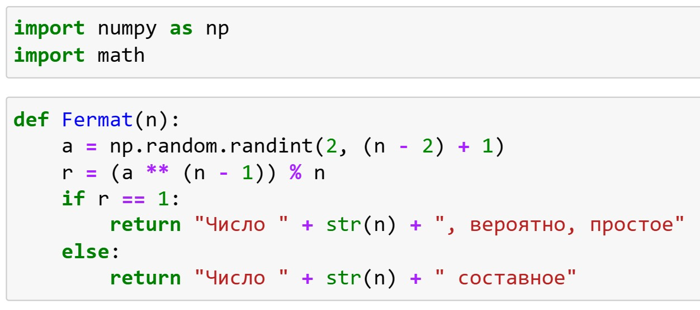
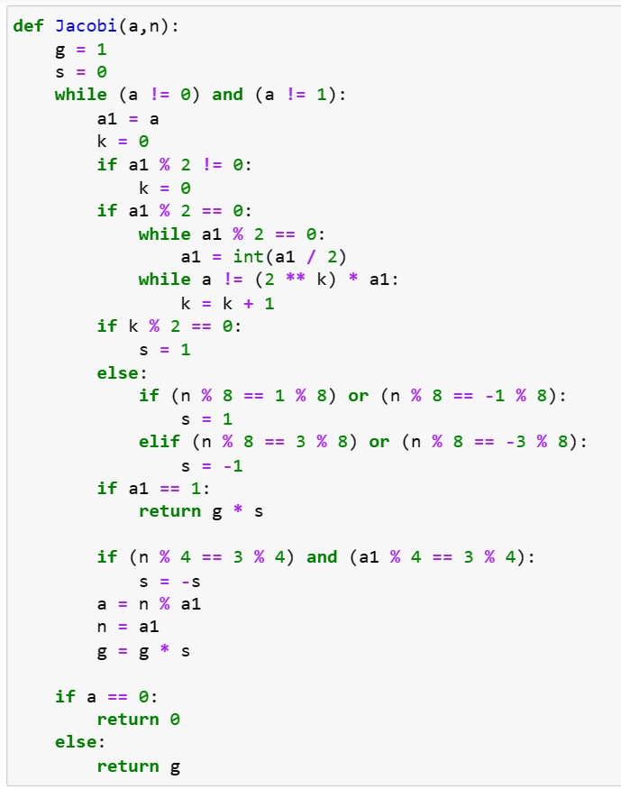
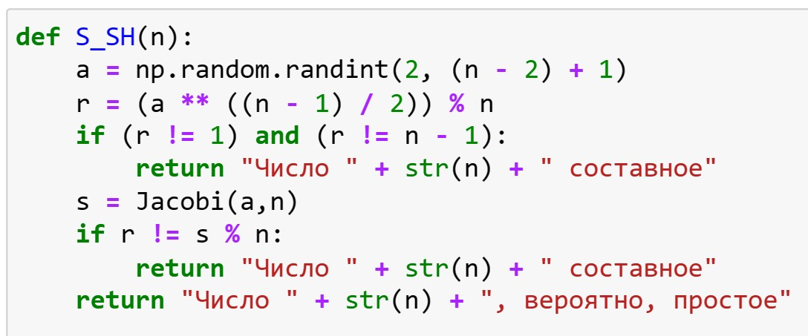
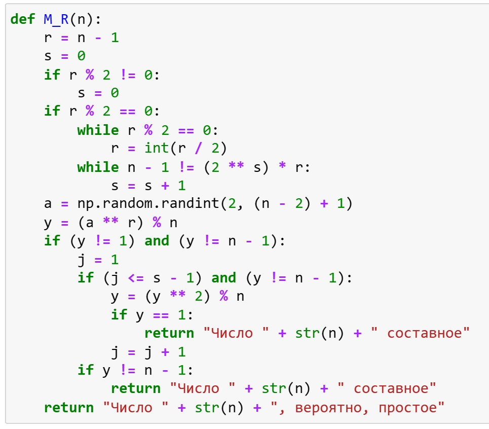
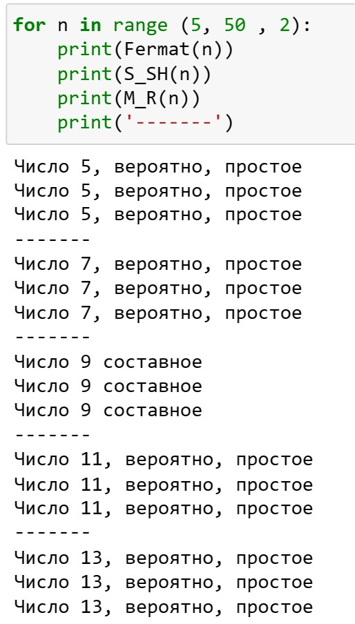
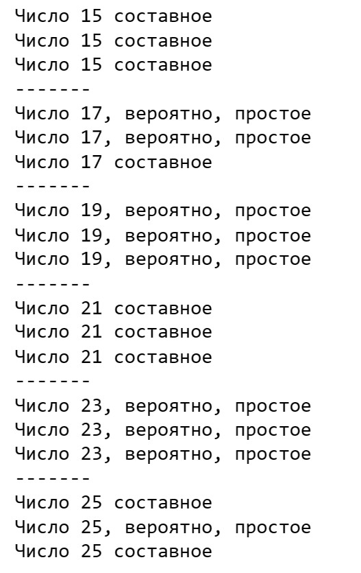

---
## Front matter
lang: ru-RU
title: Лабораторная работа №5
subtitle: Математические основы защиты информации и информационной безопасности
author:
  - Леонтьева К. А., НПМмд-02-23
institute:
  - Российский университет дружбы народов
  - Москва, Россия
date: 19 октября 2023

## i18n babel
babel-lang: russian
babel-otherlangs: english

## Formatting pdf
toc: false
toc-title: Содержание
slide_level: 2
aspectratio: 169
section-titles: true
theme: metropolis
header-includes:
 - \metroset{progressbar=frametitle,sectionpage=progressbar,numbering=fraction}
 - '\makeatletter'
 - '\beamer@ignorenonframefalse'
 - '\makeatother' 
---

## Цель лабораторной работы

1) Реализовать на языке программирования вероятностные алгоритмы проверки чисел на простоту

## Теоретическое введение

Пусть $a$ - целое число. Числа $\pm 1$, $\pm a$ называются __тривиальными делителями__ числа $a$.

Целое число $p \in Z/\{0\}$ называется __простым__, если оно не является делителем единицы и не имеет других делителей, кроме тривиальных. В противном случае число $p \in Z/\{-1,0,1\}$ называется __составным__.

## Теоретическое введение

__Детерминированный__ алгоритм всегда действует по одной и той же схеме и гарантированно решает поставленную задачу (или не дает никакого ответа).

__Вероятностный__ алгоритм использует генератор случайных чисел и дает не гарантированно точный ответ. Вероятностные алгоритмы в общем случае не менее эффективны, чем детерминированные (если используемый генератор случайных чисел всегда дает набор одних и тех же чисел, зависящих от входных данных, то вероятностный алгоритм становится детерминированным).

## Теоретическое введение

Для проверки на простоту числа $n$ вероятностным алгоритмом выбирают случайное число $a \ $ $(1<a<n)$ и проверяют условия алгоритма. Если число $n$ не проходит тест по основанию $a$, то алгоритм выдает результат "Число $n$ составное", и число $n$ действительно является составным.

Если же $n$ проходит тест по основанию $a$, ничего нельзя сказать о том, действительно ли число $n$ является простым. Последовательно проведя ряд проверок таким тестом для разных $a$ и получив для каждого из них ответ "Число $n$, вероятно, простое", можно утверждать, что число $n$ является простым с вероятностью, близкой к 1. 

## Ход выполнения лабораторной работы
- Реализуем тест Ферма

{ #fig:001 width=50% }

## Ход выполнения лабораторной работы

- Реализуем вычисление символа Якоби

{ #fig:002 width=35% }

## Ход выполнения лабораторной работы

- Реализуем тест Соловэя-Штрассена

{ #fig:003 width=40% }

## Ход выполнения лабораторной работы 

- Реализуем тест Миллера-Рабина

{ #fig:004 width=40% }

## Ход выполнения лабораторной работы 

- Получили следующие результаты

{ #fig:005 width=25% }

## Ход выполнения лабораторной работы 

- Получили следующие результаты

{ #fig:006 width=25% }

## Вывод
- В ходе выполнения данной лабораторной работы были реализованы вероятностные алгоритмы проверки чисел на простоту

