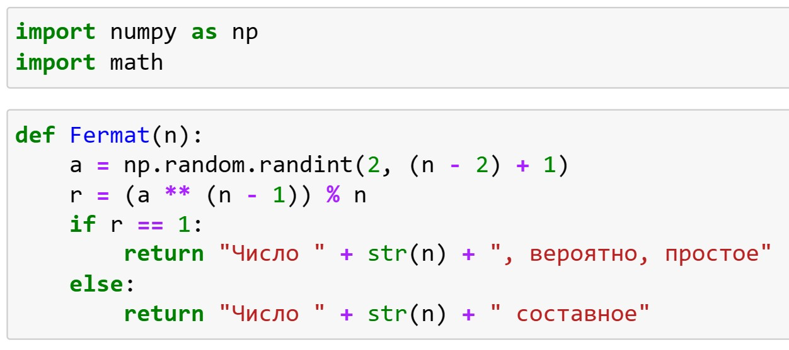
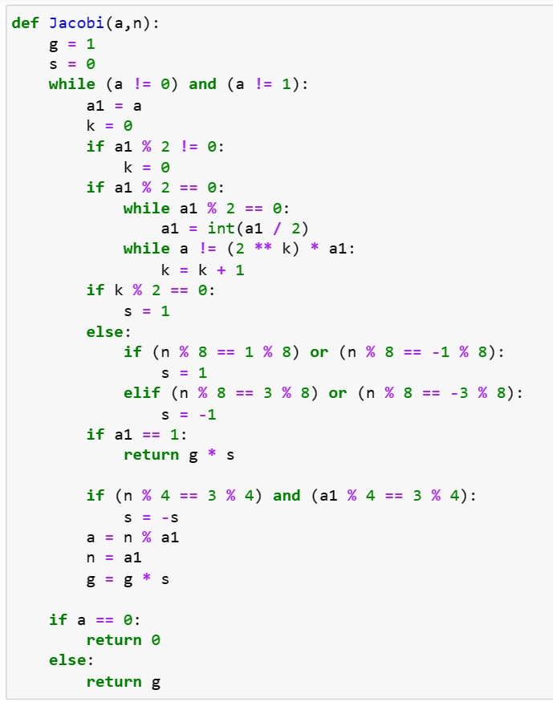
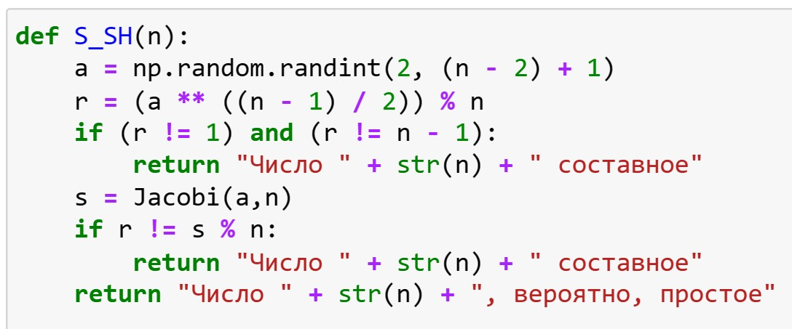
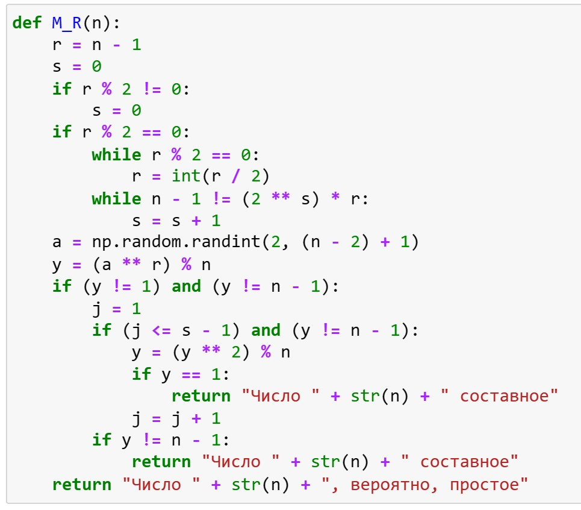
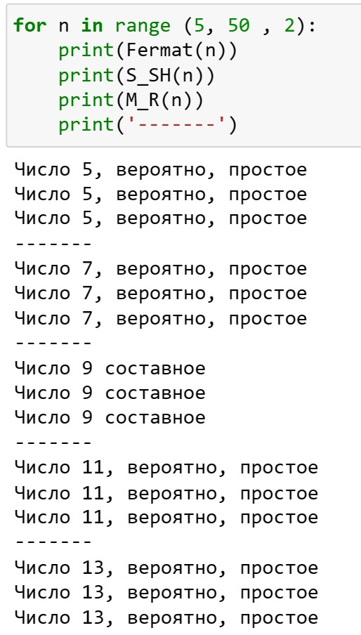
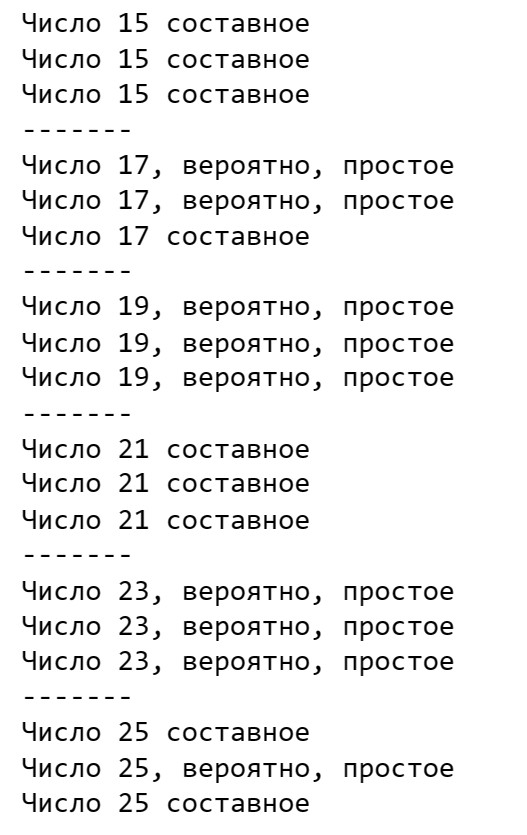
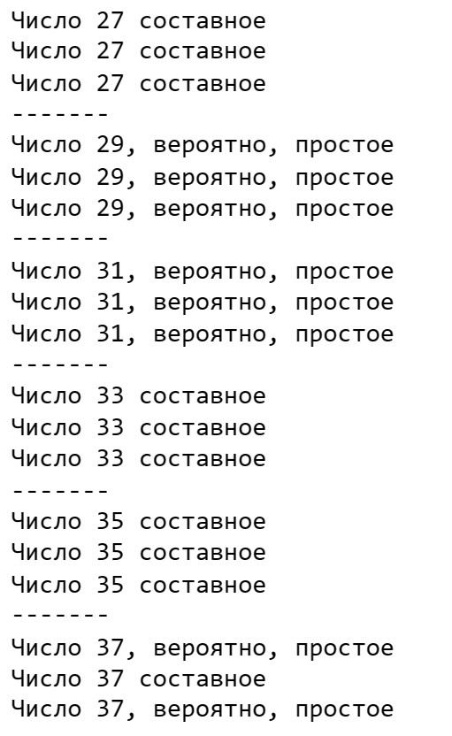
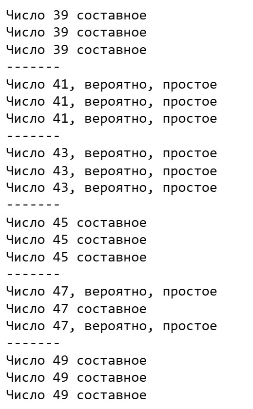

---
## Front matter
title: "Лабораторная работа №5"
subtitle: "Математические основы защиты информации и информационной безопасности"
author: "Леонтьева Ксения Андреевна | НПМмд-02-23"

## Generic otions
lang: ru-RU
toc-title: "Содержание"

## Bibliography
bibliography: bib/cite.bib
csl: pandoc/csl/gost-r-7-0-5-2008-numeric.csl

## Pdf output format
toc: true # Table of contents
toc-depth: 2
lof: true # List of figures
fontsize: 12pt
linestretch: 1.5
papersize: a4
documentclass: scrreprt
## I18n polyglossia
polyglossia-lang:
  name: russian
  options:
	- spelling=modern
	- babelshorthands=true
polyglossia-otherlangs:
  name: english
## I18n babel
babel-lang: russian
babel-otherlangs: english
## Fonts
mainfont: PT Serif
romanfont: PT Serif
sansfont: PT Sans
monofont: PT Mono
mainfontoptions: Ligatures=TeX
romanfontoptions: Ligatures=TeX
sansfontoptions: Ligatures=TeX,Scale=MatchLowercase
monofontoptions: Scale=MatchLowercase,Scale=0.9
## Biblatex
biblatex: true
biblio-style: "gost-numeric"
biblatexoptions:
  - parentracker=true
  - backend=biber
  - hyperref=auto
  - language=auto
  - autolang=other*
  - citestyle=gost-numeric
## Pandoc-crossref LaTeX customization
figureTitle: "Рис."
tableTitle: "Таблица"
listingTitle: "Листинг"
lofTitle: "Список иллюстраций"
lotTitle: "Список таблиц"
lolTitle: "Листинги"
## Misc options
indent: true
header-includes:
  - \usepackage{indentfirst}
  - \usepackage{float} # keep figures where there are in the text
  - \floatplacement{figure}{H} # keep figures where there are in the text
---

# Цель работы

Реализовать на языке программирования вероятностные алгоритмы проверки чисел на простоту.

# Теоретическое введение

Пусть $a$ - целое число. Числа $\pm 1$, $\pm a$ называются __тривиальными делителями__ числа $a$.

Целое число $p \in Z/\{0\}$ называется __простым__, если оно не является делителем единицы и не имеет других делителей, кроме тривиальных. В противном случае число $p \in Z/\{-1,0,1\}$ называется __составным__.

Алгоритмы проверки на простоту можно разделить на вероятностные и детерминированные.

__Детерминированный__ алгоритм всегда действует по одной и той же схеме и гарантированно решает поставленную задачу (или не дает никакого ответа). __Вероятностный__ алгоритм использует генератор случайных чисел и дает не гарантированно точный ответ. Вероятностные алгоритмы в общем случае не менее эффективны, чем детерминированные (если используемый генератор случайных чисел всегда дает набор одних и тех же чисел, зависящих от входных данных, то вероятностный алгоритм становится детерминированным).

Для проверки на простоту числа $n$ вероятностным алгоритмом выбирают случайное число $a \ $ $(1<a<n)$ и проверяют условия алгоритма. Если число $n$ не проходит тест по основанию $a$, то алгоритм выдает результат "Число $n$ составное", и число $n$ действительно является составным.

Если же $n$ проходит тест по основанию $a$, ничего нельзя сказать о том, действительно ли число $n$ является простым. Последовательно проведя ряд проверок таким тестом для разных $a$ и получив для каждого из них ответ "Число $n$, вероятно, простое", можно утверждать, что число $n$ является простым с вероятностью, близкой к 1. При $t$ независимых выполнений теста вероятность того, что составное число $n \ $ будет $\ t \ $ раз объявлено простым (вероятность ошибки), не превосходит $\frac{1}{2^t}$.

Более подробно см. в [@Fermat:bash], [@Jacobi:bash], [@S_SH:bash], [@M_R:bash]. 

# Выполнение лабораторной работы

Тест Ферма реализуем по следующей схеме:

На вход подается нечетное целое число $n \geq 5$.

1. Выбрать случайное целое число $a, \ $ $2 \leq a \leq n-2$.

2. Вычислить $r \gets a^{n-1} (mod \ n)$.

3. При $r=1$ результат: "Число $n$, вероятно, простое". В противном случае результат: "Число $n$ составное".

Код программы (рис. [-@fig:001]).
 
{ #fig:001 width=60% }

Вычисление символа Якоби реализуем по следующей схеме:

На вход подаются нечетное целое число $n \geq 3$ и целое число $a$, $0 \leq a < n$.

1. Положить $g \gets 1$.

2. При $a=0$ результат $0$.

3. При $a=1$ результат $g$.

4. Представить $a$ в виде $a=2^k a_1$, где число $a_1$ нечетное.

5. При четном $k$ положить $s \gets 1$, при нечетном $k$ положить $s \gets 1$, если $n \equiv \pm 1 (mod \ 8)$; положить $s \gets -1$, если $n \equiv \pm 3 (mod \ 8)$.

6. При $a_1=1$ результат: $gs$.

7. Если $n \equiv 3 (mod \ 4)$ и $a_1 \equiv 3 (mod \ 4)$, то $s \gets -s$.

8. Положить $a \gets n(mod \ a_1), n \gets a_1, g \gets gs$ и вернуться на шаг 2.

Код программы (рис. [-@fig:002]).
 
{ #fig:002 width=60% }

Тест Соловэя-Штрассена реализуем по следующей схеме:

На вход подается нечетное целое число $n \geq 5$.

1. Выбрать случайное целое число $a, \ $ $2 \leq a \leq n-2$.

2. Вычислить $r \gets a^{\frac{n-1}{2}} (mod \ n)$.

3. При $r \neq 1$ и $r \neq n-1$ результат: "Число $n$ составное".

4. Вычислить символ Якоби $s \gets (\frac{a}{n})$.

5. При $r \equiv s (mod \ n)$ результат: "Число $n$ составное". В противном случае результат: "Число $n$, вероятно, простое".

Код программы (рис. [-@fig:003]).
 
{ #fig:003 width=60% }

Тест Миллера-Рабина реализуем по следующей схеме:

На вход подается нечетное целое число $n \geq 5$.

1. Представить $n-1$ в виде $n-1 = 2^s r$, где число $r$ нечетное.

2. Выбрать случайное целое число $a, \ $ $2 \leq a \leq n-2$.

3. Вычислить $y \gets a^r (mod \ n)$.

4. При $y \neq 1$ и $y \neq n-1$ выполнить следующие действия.

4.1. Положить $j \gets 1$.

4.2. Если $j \leq s-1$ и $y \neq n-1$, то

4.2.1. Положить $y \gets y^2 (mod \ n)$.

4.2.2. При $y=1$ результат: "Число $n$ составное".

4.2.3. Положить $j \gets j+1$.

4.3. При $y \neq n-1$ результат: "Число $n$ составное".

5. Результат: "Число $n$, вероятно, простое".

Код программы (рис. [-@fig:004]).
 
{ #fig:004 width=60% }

В итоге были получены следующие результаты (рис. [-@fig:005]) - (рис. [-@fig:008]).

{ #fig:005 width=35% }

{ #fig:006 width=35% }

{ #fig:007 width=35% }

{ #fig:008 width=35% }

# Выводы

В ходе выполнения данной лабораторной работы были реализованы вероятностные алгоритмы проверки чисел на простоту.

# Список литературы{.unnumbered}

::: {#refs}
:::
