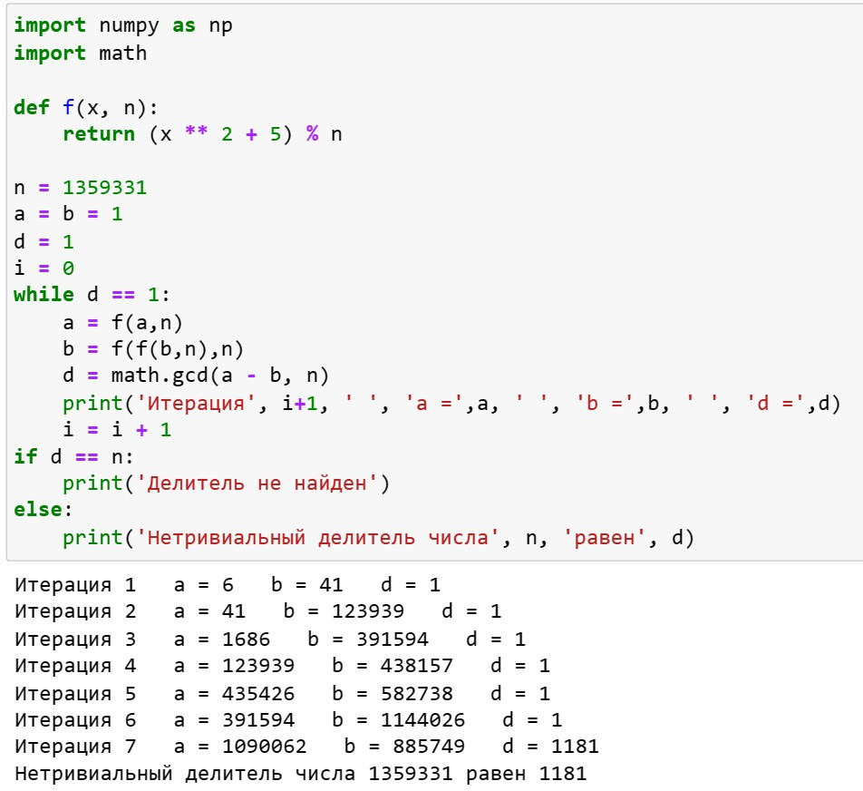

---
## Front matter
title: "Лабораторная работа №6"
subtitle: "Математические основы защиты информации и информационной безопасности"
author: "Леонтьева Ксения Андреевна | НПМмд-02-23"

## Generic otions
lang: ru-RU
toc-title: "Содержание"

## Bibliography
bibliography: bib/cite.bib
csl: pandoc/csl/gost-r-7-0-5-2008-numeric.csl

## Pdf output format
toc: true # Table of contents
toc-depth: 2
lof: true # List of figures
fontsize: 12pt
linestretch: 1.5
papersize: a4
documentclass: scrreprt
## I18n polyglossia
polyglossia-lang:
  name: russian
  options:
	- spelling=modern
	- babelshorthands=true
polyglossia-otherlangs:
  name: english
## I18n babel
babel-lang: russian
babel-otherlangs: english
## Fonts
mainfont: PT Serif
romanfont: PT Serif
sansfont: PT Sans
monofont: PT Mono
mainfontoptions: Ligatures=TeX
romanfontoptions: Ligatures=TeX
sansfontoptions: Ligatures=TeX,Scale=MatchLowercase
monofontoptions: Scale=MatchLowercase,Scale=0.9
## Biblatex
biblatex: true
biblio-style: "gost-numeric"
biblatexoptions:
  - parentracker=true
  - backend=biber
  - hyperref=auto
  - language=auto
  - autolang=other*
  - citestyle=gost-numeric
## Pandoc-crossref LaTeX customization
figureTitle: "Рис."
tableTitle: "Таблица"
listingTitle: "Листинг"
lofTitle: "Список иллюстраций"
lotTitle: "Список таблиц"
lolTitle: "Листинги"
## Misc options
indent: true
header-includes:
  - \usepackage{indentfirst}
  - \usepackage{float} # keep figures where there are in the text
  - \floatplacement{figure}{H} # keep figures where there are in the text
---

# Цель работы

Реализовать на языке программирования p-метод Полларда.

# Теоретическое введение

__Задача разложения составного числа на множители__ формулируется следующим образом: для данного положительного целого числа $n$ найти его каноническое разложение $n=p_1^{\alpha_1} p_2^{\alpha_2} ... p_s^{\alpha_s}$, где $p_i$ - попарно различные простые числа, $\alpha_i \geq 1$.

На практике необязательно находить каноническое разложение числа $n$. Достаточно найти его разложение на два *нетривиальных сомножителя:* $n=pq, 1 \leq p \leq q < n$.

__p-метод Полларда.__ Пусть $n$ - нечетное составное число, $S=\{0,1,...,n-1\}$ и $f: S \to S$ - случайное отображение, обладающее сжимающими свойствами, например, $f(x) \equiv (x^2 + 1) (mod \ n)$. Основная идея метода состоит в следующем. Выбираем случайный элемент $x_0 \in S$ и строим последовательность $x_0, x_1, x_2,...,$ определяемую рекуррентным соотношением $$x_{i+1}=f(x_i),$$ где $i \geq 0$, до тех пор, пока не найдем такие числа $i,j$, что $i<j$ и $x_i=x_j$. Поскольку множество $S$ конечно, такие индексы $i,j$ существуют. Последовательность $\{x_i\}$ будет состоять из "хвоста" $x_0, x_1, ..., x_{i-1}$ длины $O(\sqrt{\frac{\pi n}{8}})$ и цикла $x_i=x_j,x_{i+1},...,x_{j-1}$ той же длины.

Более подробно см. в [@Pollard:bash]. 

# Выполнение лабораторной работы

p-метод Полларда реализуем по следующей схеме:

На вход подается число $n$, начальное значение $c$, функция $f$, обладающая сжимающими свойствами.

1. Положить $a \gets c, b \gets c$.

2. Создать функцию $f(x,n) = (x^2 + 5) (mod \ n)$

3. Вычислить $a \gets f(a,n), b \gets f(f(b,n), n)$.

4. Найти $d \gets$ НОД $(a-b,n)$

4. Если $1<d<n$, то положить $p \gets d$ и результат: $p$. При $d=n$ результат: "Делитель не найден"; при $d=1$ вернуться на шаг 2.

Код программы (рис. [-@fig:001]).
 
{ #fig:001 width=80% }

# Выводы

В ходе выполнения данной лабораторной работы был реализован p-метод Полларда.

# Список литературы{.unnumbered}

::: {#refs}
:::
