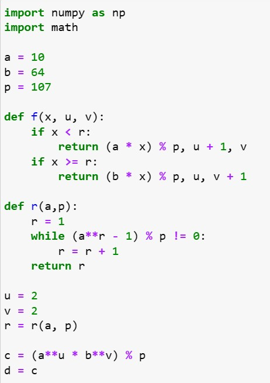
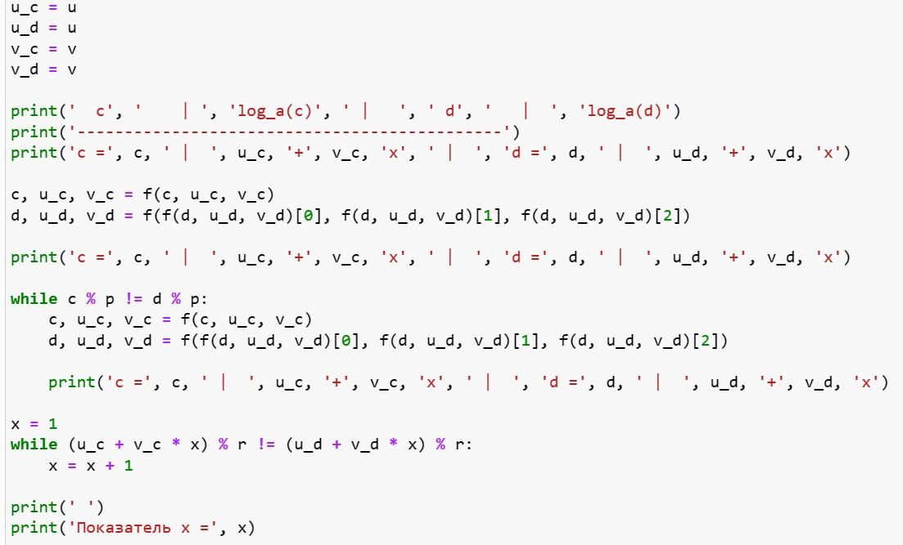
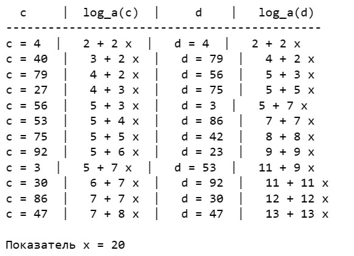

---
## Front matter
lang: ru-RU
title: Лабораторная работа №7
subtitle: Математические основы защиты информации и информационной безопасности
author:
  - Леонтьева К. А., НПМмд-02-23
institute:
  - Российский университет дружбы народов
  - Москва, Россия
date: 5 ноября 2023

## i18n babel
babel-lang: russian
babel-otherlangs: english

## Formatting pdf
toc: false
toc-title: Содержание
slide_level: 2
aspectratio: 169
section-titles: true
theme: metropolis
header-includes:
 - \metroset{progressbar=frametitle,sectionpage=progressbar,numbering=fraction}
 - '\makeatletter'
 - '\beamer@ignorenonframefalse'
 - '\makeatother' 
---

## Цель лабораторной работы

1) Реализовать на языке программирования p-метод Полларда для дискретного логарифмирования 

## Теоретическое введение

Обозначим $F_p=Z/pZ$, $p$ - простое целое число и назовем конечным полем из $p$ элементов. __Задача дискретного логарифмирования__ в конечном поле $F_p$ формулируется так: для данных целых чисел $a$ и $b$, $a>1, b>p$, найти логарифм - такое целое число x, что $a^x \equiv b (mod \ p)$ (если такое число существует). По аналогии с вещественными числами используется обозначение $x=log_{a}b$.
 
## Теоретическое введение

Безопасность соответствующих криптосистем основана на том, что зная числа $a, x, p$ вычислить $a^x(mod \ p)$ легко, а решить задачу дискретного логарифмирования трудно. Рассмотрим __p-метод Полларда__, который можно применить и для задач дискретного логарифмирования. При этом случайное отображение $f$ должно обладать не только сжимающими свойствами, но и вычислимостью логарифма (логарифм числа $f(c)$ можно выразить через неизвестный логарифм $x$ и $log_{a}f(c))$. Для дискретного логарифмирования в качестве случайного отображения $f$ чаще всего используются ветвящиеся отображения, например: 
\begin{equation*}
f(c) = 
 \begin{cases}
   ac &\text{при $c<\frac{p}{2}$}\\
   bc &\text{при $c>\frac{p}{2}$}
 \end{cases}
\end{equation*}

При $c<\frac{p}{2}$: $log_{a}f(c)=log_{a}c+1$, при $c>\frac{p}{2}$: $log_{a}f(c)=log_{a}c+x$.

## Ход выполнения лабораторной работы
- Реализуем p-метод Полларда для дискретного логарифмирования

{ #fig:001 width=31% }

## Ход выполнения лабораторной работы

{ #fig:002 width=80% }

## Ход выполнения лабораторной работы

{ #fig:003 width=45% }

## Вывод
- В ходе выполнения данной лабораторной работы был реализован p-метод Полларда для дискретного логарифмирования

