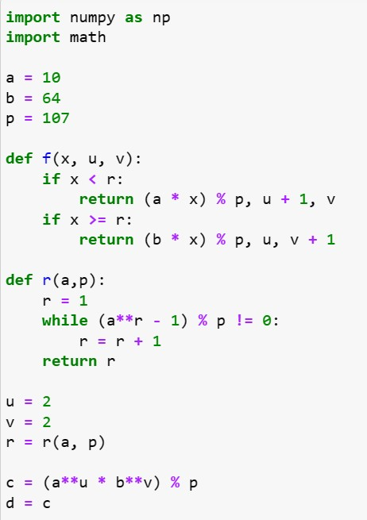
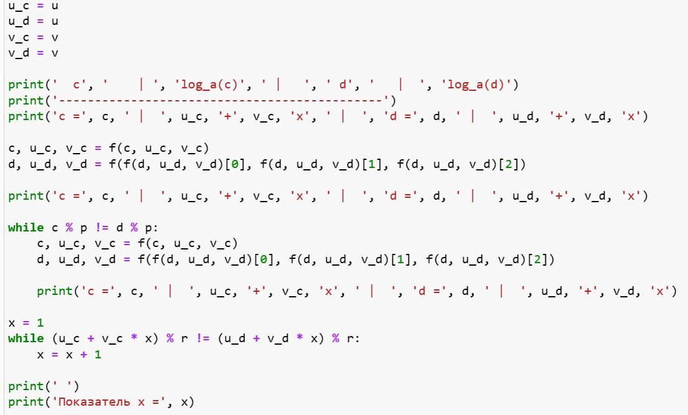
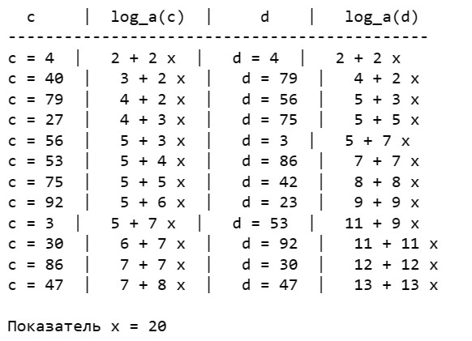

---
## Front matter
title: "Лабораторная работа №7"
subtitle: "Математические основы защиты информации и информационной безопасности"
author: "Леонтьева Ксения Андреевна | НПМмд-02-23"

## Generic otions
lang: ru-RU
toc-title: "Содержание"

## Bibliography
bibliography: bib/cite.bib
csl: pandoc/csl/gost-r-7-0-5-2008-numeric.csl

## Pdf output format
toc: true # Table of contents
toc-depth: 2
lof: true # List of figures
fontsize: 12pt
linestretch: 1.5
papersize: a4
documentclass: scrreprt
## I18n polyglossia
polyglossia-lang:
  name: russian
  options:
	- spelling=modern
	- babelshorthands=true
polyglossia-otherlangs:
  name: english
## I18n babel
babel-lang: russian
babel-otherlangs: english
## Fonts
mainfont: PT Serif
romanfont: PT Serif
sansfont: PT Sans
monofont: PT Mono
mainfontoptions: Ligatures=TeX
romanfontoptions: Ligatures=TeX
sansfontoptions: Ligatures=TeX,Scale=MatchLowercase
monofontoptions: Scale=MatchLowercase,Scale=0.9
## Biblatex
biblatex: true
biblio-style: "gost-numeric"
biblatexoptions:
  - parentracker=true
  - backend=biber
  - hyperref=auto
  - language=auto
  - autolang=other*
  - citestyle=gost-numeric
## Pandoc-crossref LaTeX customization
figureTitle: "Рис."
tableTitle: "Таблица"
listingTitle: "Листинг"
lofTitle: "Список иллюстраций"
lotTitle: "Список таблиц"
lolTitle: "Листинги"
## Misc options
indent: true
header-includes:
  - \usepackage{indentfirst}
  - \usepackage{float} # keep figures where there are in the text
  - \floatplacement{figure}{H} # keep figures where there are in the text
---

# Цель работы

Реализовать на языке программирования p-метод Полларда для дискретного логарифмирования.

# Теоретическое введение

__Задача дискретного логарифмирования__ применяется во многих алгоритмах криптографии с открытым ключом. Предложенная в 1976 году У. Дифии и М. Хеллманом для установления сеансового ключа, эта задача послежила основой для создания протоколов шифрования и цифровой подписи, доказательств с нулевым разглашением и других криптографических протоколов.

Обозначим $F_p=Z/pZ$, $p$ - простое целое число и назовем конечным полем из $p$ элементов. Задача дискретного логарифмирования в конечном поле $F_p$ формулируется так: для данных целых чисел $a$ и $b$, $a>1, b>p$, найти логарифм - такое целое число x, что $a^x \equiv b (mod \ p)$ (если такое число существует). По аналогии с вещественными числами используется обозначение $x=log_{a}b$.

Безопасность соответствующих криптосистем основана на том, что зная числа $a, x, p$ вычислить $a^x(mod \ p)$ легко, а решить задачу дискретного логарифмирования трудно. Рассмотрим p-метод Полларда, который можно применить и для задач дискретного логарифмирования. При этом случайное отображение $f$ должно обладать не только сжимающими свойствами, но и вычислимостью логарифма (логарифм числа $f(c)$ можно выразить через неизвестный логарифм $x$ и $log_{a}f(c))$. Для дискретного логарифмирования в качестве случайного отображения $f$ чаще всего используются ветвящиеся отображения, например: 
\begin{equation*}
f(c) = 
 \begin{cases}
   ac &\text{при $c<\frac{p}{2}$}\\
   bc &\text{при $c>\frac{p}{2}$}
 \end{cases}
\end{equation*}

При $c<\frac{p}{2}$: $log_{a}f(c)=log_{a}c+1$, при $c>\frac{p}{2}$: $log_{a}f(c)=log_{a}c+x$.

Более подробно см. в [@Pollard:bash]. 

# Выполнение лабораторной работы

p-метод Полларда для дискретного логарифмирования реализуем по следующей схеме:

_Вход._ Простое число $p$, число $a$ порядка $r$ по модулю $p$, целое число $b, 1<b<p$, отображение $f$, обладающее сжимающими свойствами и сохраняющее вычислимость логарифма.

_Выход._ Показатель $x$, для которого $a^x \equiv b (mod \ p)$, если такой показатель существует.

1. Выбрать произвольные целые числа $u$, $v$ и положить $c \gets a^ub^v (mod \ p)$, $d \gets c$.

2. Выполнять $c \gets f(c)(mod \ p)$, $d \gets f(f(d))(mod \ p)$, вычисляя при этом логарифмы для $c$ и $d$ как линейные функции от $x$ по модулю $r$ вида $u+vx$, до получения равенства $c \equiv d (mod \ p)$.

3. Приравняв логарифмы для $c$ и $d$, вычислить логарифм $x$ решением сравнения по модулю $r$. Результат: $x$ или "Решений нет".

Код программы (рис. [-@fig:001] - [-@fig:003]).
 
{ #fig:001 width=50% }

{ #fig:002 width=110% }

{ #fig:003 width=70% }

# Выводы

В ходе выполнения данной лабораторной работы был реализован p-метод Полларда для дискретного логарифмирования.

# Список литературы{.unnumbered}

::: {#refs}
:::
