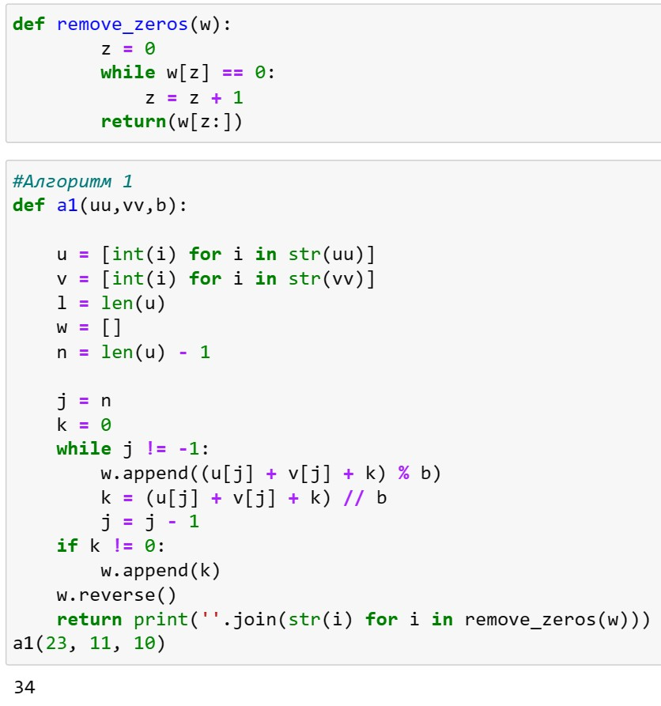
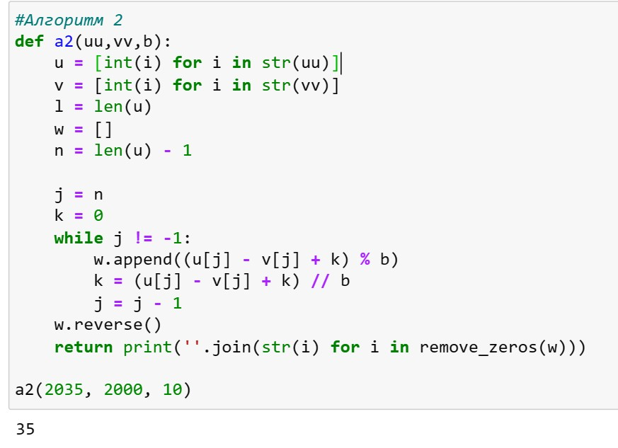
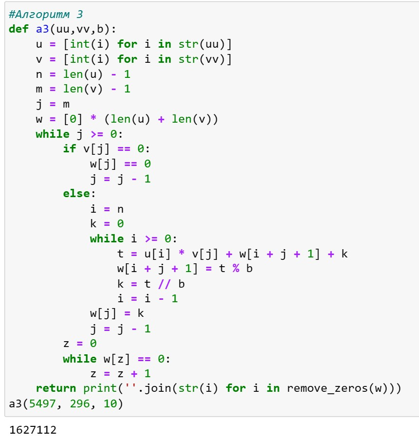
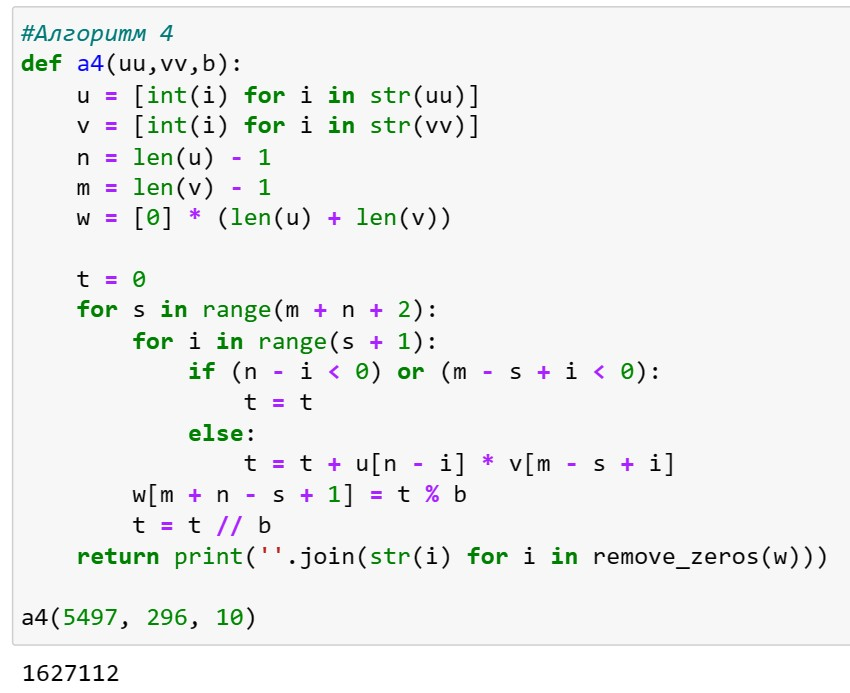
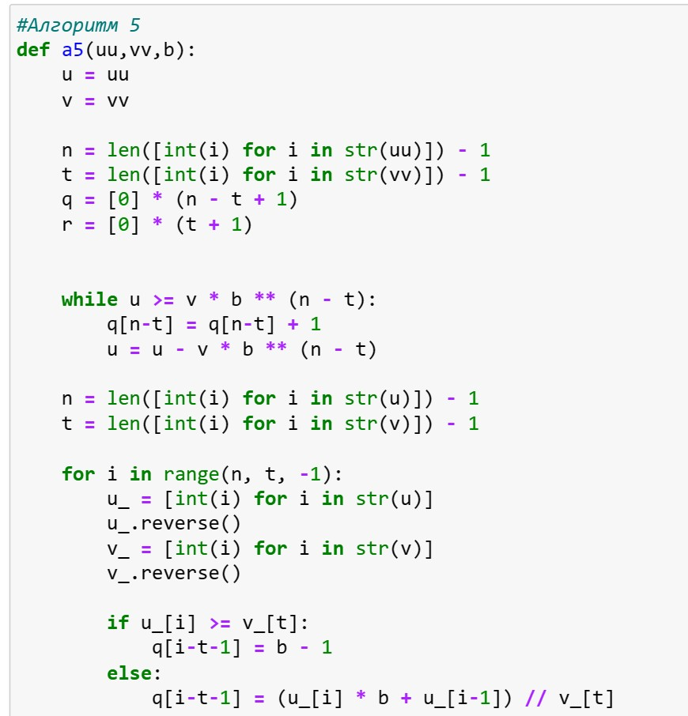
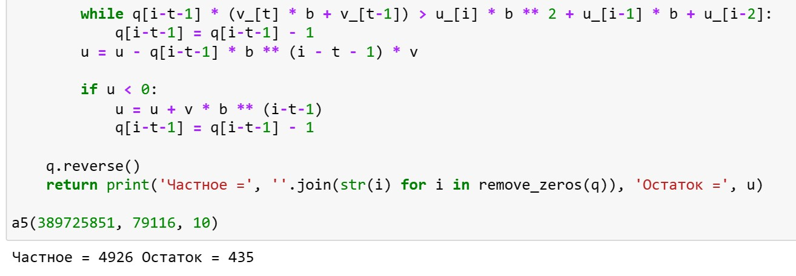

---
## Front matter
lang: ru-RU
title: Лабораторная работа №8
subtitle: Математические основы защиты информации и информационной безопасности
author:
  - Леонтьева К. А., НПМмд-02-23
institute:
  - Российский университет дружбы народов
  - Москва, Россия
date: 7 ноября 2023

## i18n babel
babel-lang: russian
babel-otherlangs: english

## Formatting pdf
toc: false
toc-title: Содержание
slide_level: 2
aspectratio: 169
section-titles: true
theme: metropolis
header-includes:
 - \metroset{progressbar=frametitle,sectionpage=progressbar,numbering=fraction}
 - '\makeatletter'
 - '\beamer@ignorenonframefalse'
 - '\makeatother' 
---

## Цель лабораторной работы

1) Реализовать на языке программирования алгоритмы для выполнения арифметических операций с большими целыми числами 

## Теоретическое введение

Считаем, что число записано в $b$-ичной системе счисления, $b$ - натуральное число, $b \geq 2$. Натуральное $n$-разрядное число будем записывать в виде $$u = u_1 u_2...u_n.$$ При работе с большими целыми числами знак такого числа удобно хранить в отдельной переменной. Например, при умножении двух чисел, знак произведения вычисляется отдельно. Квадратные скобки обозначают, что берется целая часть числа.
 

## Ход выполнения лабораторной работы
- Реализуем алгоритм сложения неотрицательных целых чисел

{ #fig:001 width=42% }

## Ход выполнения лабораторной работы
- Реализуем алгоритм вычитания неотрицательных целых чисел

{ #fig:002 width=60% }

## Ход выполнения лабораторной работы
- Реализуем алгоритм умножения неотрицательных целых чисел столбиком

{ #fig:003 width=43% }

## Ход выполнения лабораторной работы
- Реализуем алгоритм умножения быстрым столбиком

{ #fig:004 width=55% }

## Ход выполнения лабораторной работы
- Реализуем алгоритм деления многоразрядных целых чисел

{ #fig:005 width=43% }

## Ход выполнения лабораторной работы

{ #fig:006 width=65% }

## Вывод
- В ходе выполнения данной лабораторной работы были реализованы алгоритмы для выполнения арифметических операций с большими целыми числами

