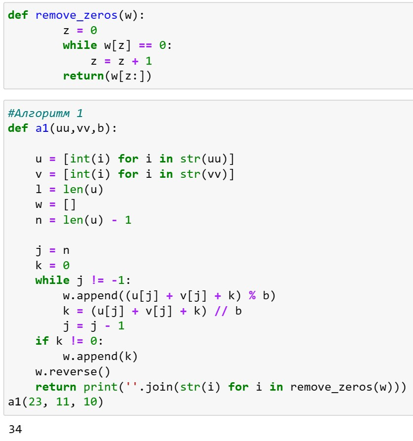
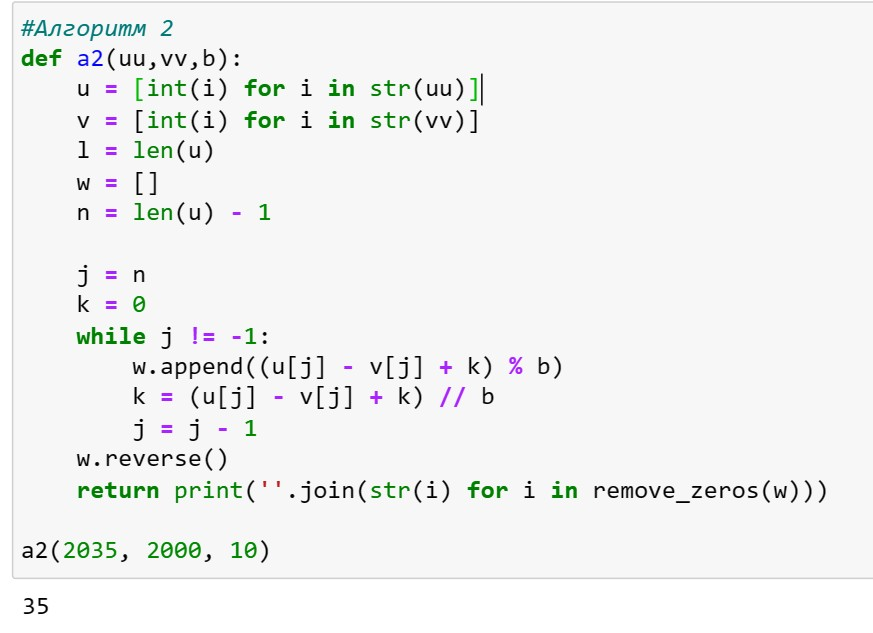
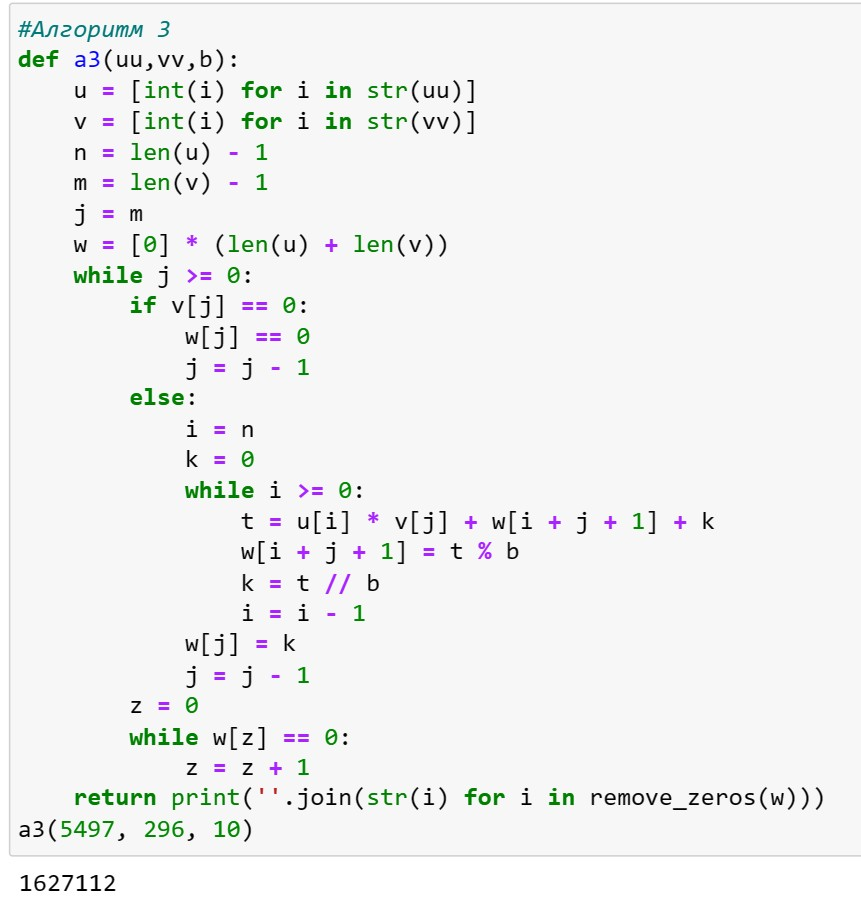
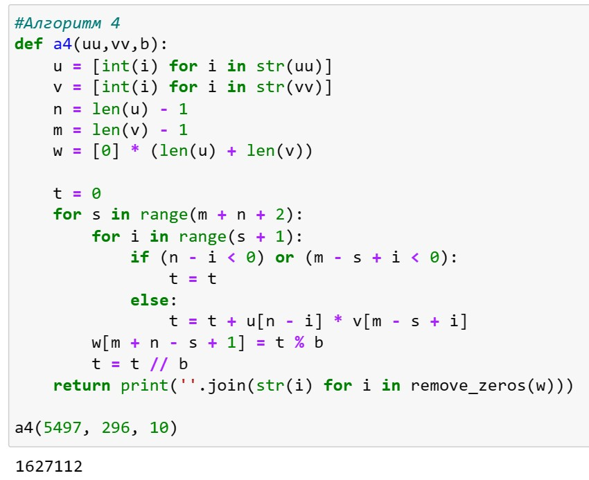
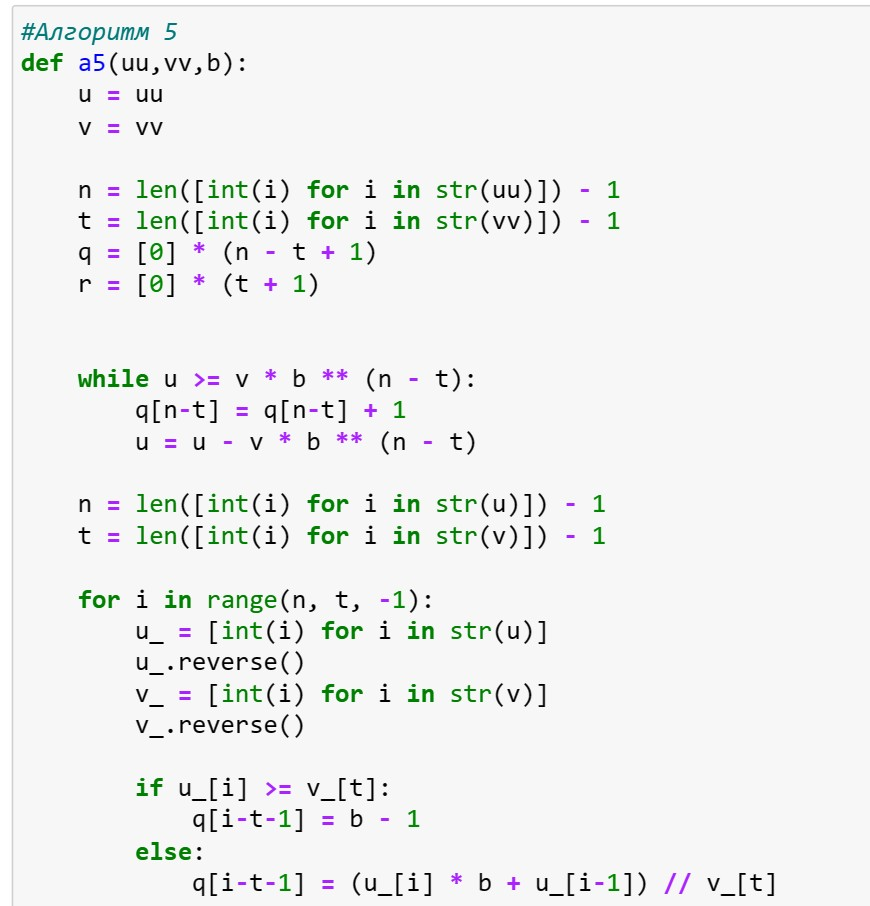
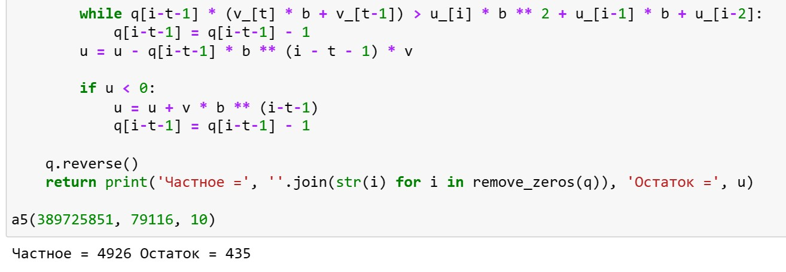

---
## Front matter
title: "Лабораторная работа №8"
subtitle: "Математические основы защиты информации и информационной безопасности"
author: "Леонтьева Ксения Андреевна | НПМмд-02-23"

## Generic otions
lang: ru-RU
toc-title: "Содержание"

## Bibliography
bibliography: bib/cite.bib
csl: pandoc/csl/gost-r-7-0-5-2008-numeric.csl

## Pdf output format
toc: true # Table of contents
toc-depth: 2
lof: true # List of figures
fontsize: 12pt
linestretch: 1.5
papersize: a4
documentclass: scrreprt
## I18n polyglossia
polyglossia-lang:
  name: russian
  options:
	- spelling=modern
	- babelshorthands=true
polyglossia-otherlangs:
  name: english
## I18n babel
babel-lang: russian
babel-otherlangs: english
## Fonts
mainfont: PT Serif
romanfont: PT Serif
sansfont: PT Sans
monofont: PT Mono
mainfontoptions: Ligatures=TeX
romanfontoptions: Ligatures=TeX
sansfontoptions: Ligatures=TeX,Scale=MatchLowercase
monofontoptions: Scale=MatchLowercase,Scale=0.9
## Biblatex
biblatex: true
biblio-style: "gost-numeric"
biblatexoptions:
  - parentracker=true
  - backend=biber
  - hyperref=auto
  - language=auto
  - autolang=other*
  - citestyle=gost-numeric
## Pandoc-crossref LaTeX customization
figureTitle: "Рис."
tableTitle: "Таблица"
listingTitle: "Листинг"
lofTitle: "Список иллюстраций"
lotTitle: "Список таблиц"
lolTitle: "Листинги"
## Misc options
indent: true
header-includes:
  - \usepackage{indentfirst}
  - \usepackage{float} # keep figures where there are in the text
  - \floatplacement{figure}{H} # keep figures where there are in the text
---

# Цель работы

Реализовать на языке программирования алгоритмы для выполнения арифметических операций с большими целыми числами.

# Теоретическое введение

Считаем, что число записано в $b$-ичной системе счисления, $b$ - натуральное число, $b \geq 2$. Натуральное $n$-разрядное число будем записывать в виде $$u = u_1 u_2...u_n$$. При работе с большими целыми числами знак такого числа удобно хранить в отдельной переменной. Например, при умножении двух чисел, знак произведения вычисляется отдельно. Квадратные скобки обозначают, что берется целая часть числа.

Более подробно см. в [@Pollard:bash]. 

# Выполнение лабораторной работы

__Алгоритм 1 (сложение неотрицательных целых чисел).__

_Вход._ Два неотрицательных числа $u=u_1u_2...u_n$ и $v=v_1v_2...v_n$; разрядность чисел $n$; основание системы счисления $b$.

_Выход._ Сумма $w=w_0w_1...w_n$, где $w_0$ - цифра переноса - всегда равная 0 или 1.

1. Присвоить $j = n$, $k = 0$ ($j$ идет по разрядам, $k$ следит за переносом).

2. Присвоить $w_j=(u_j+v_j+k)(mod \ b)$, где $w_j$ - наименьший неотрицательный вычет в данном классе вычетов; $k=[\frac{u_j+v_j+k}{b}]$.

3. Присвоить $j = j-1$. Если $j>0$, то возвращаемся на шаг 2; если $j=0$, то присвоить $w_0=k$ и результат $w$.

Код программы (рис. [-@fig:001]).
 
{ #fig:001 width=80% }

__Алгоритм 2 (вычитание неотрицательных целых чисел).__

_Вход._ Два неотрицательных числа $u=u_1u_2...u_n$ и $v=v_1v_2...v_n$, $u>v$; разрядность чисел $n$; основание системы счисления $b$.

_Выход._ Сумма $w=w_1w_2...w_n=u-v$.

1. Присвоить $j=n$, $k=0$ ($k$ - заем из старшего разряда).

2. Присвоить $w_j=(u_j-v_j+k)(mod \ b)$, где $w_j$ - наименьший неотрицательный вычет в данном классе вычетов; $k=[\frac{u_j-v_j+k}{b}]$.

3. Присвоить $j = j-1$. Если $j>0$, то возвращаемся на шаг 2; если $j=0$, то результат $w$.

Код программы (рис. [-@fig:002]).
 
{ #fig:002 width=80% }

__Алгоритм 3 (умножение неотрицательных целых чисел столбиком).__

_Вход._ Числа $u=u_1u_2...u_n$ и $v=v_1v_2...v_m$; основание системы счисления $b$.

_Выход._ Произведение $w=uv=w_1w_2...w_{m+n}$.

1. Выполнить присвоения: $w_{m+1}=0, w_{m+2}=0,...,w_{m+n}=0, j=m$ (j перемещается по номерам разрядов числа $v$ от младших к старшим).

2. Если $v_j=0$, то присвоить $w_j=0$ и перейти на шаг 6.

3. Присвоить $i=u_i \cdot v_j + w_{i+j} + k$, $w_{i+j}=t (mod \ b)$, $k = \frac{t}{b}$, где $w_{i+j}$ - наименьший неотрицательный вычет в данном классе вычетов.

4. Присвоить $i=i-1$. Если $i>0$, то возвращаемся на шаг 4, иначе присвоить $w_j=k$.

6. Присвоить $j=j-1$. Если $j>0$, то вернуться на шаг 2. Если $j=0$, то результат $w$.

Код программы (рис. [-@fig:003]).
 
{ #fig:003 width=80% }

__Алгоритм 4 (быстрый столбик).__

_Вход._ Числа $u=u_1u_2...u_n$ и $v=v_1v_2...v_m$; основание системы счисления $b$.

_Выход._ Произведение $w=uv=w_1w_2...w_{m+n}$.

1. Присвоить $t=0$.

2. Для $s$ от 0 до $m+n-1$ с шагом 1 выполнить шаги 3 и 4.

3. Для $i$ от 0 до $s$ с шагом 1 выполнить присвоение $t=t+u_{n-i} \cdot v_{m-s+i}$.

4. Присвоить $w_{m+n-s}=t (mod \ b), t=\frac{t}{b}$, где $w_{m+n-s}$ - наименьший неотрицательный вычет по модулю $b$. Результат $w$.

Код программы (рис. [-@fig:004]).
 
{ #fig:004 width=80% }

__Алгоритм 5 (деление многоразрядных целых чисел).__

_Вход._ Числа $u=u_n...u_1u_0$ и $v=v_t...v_1v_0$, $n \geq t \geq 1$, $v_t \neq 0$, разрядность чисел соответственно $n$ и $t$.

_Выход._ Частное $q=q_{n-t}...q_0$, остаток $r=r_t...r_0$.

1. Для $j$ от 0 до $n-t$ присвоить $q_j=0$.

2. Пока $u \geq vb^{n-t}$, выполнять $q_{n-t}=q_{n-t}+1$, $u=u-vb^{n-t}$.

3. Для $i=n, n-1,...,t+1$ выполнять пункты 3.1 - 3.4:

	3.1. если $u_i \geq v_t$, то присвоить $q_{i-t-1}=b-1$, иначе присвоить $q_{i-t-1}=\frac{u_ib+u_{i-1}}{v_t}$.
	
	3.2. пока $q_{i-t-1}(v_tb+v_{t-1})>u_ib^2+u_{i-1}b+u_{i-2}$ выполнять $q_{i-t-1}=q_{i-t-1}-1$.

	3.3. присвоить $u=u-q_{i-t-1}b^{i-t-1}v$

	3.4. если $u<0$, то присвоить $u=u+vb^{i-t-1}$, $q_{i-t-1}=q_{i-t-1}-1$.

4. $r=u$. Результат $q$ и $r$.

Код программы (рис. [-@fig:005] - [-@fig:006]).
 
{ #fig:005 width=80% }

{ #fig:006 width=110% }

# Выводы

В ходе выполнения данной лабораторной работы были реализованы алгоритмы для выполнения арифметических операций с большими целыми числами.

# Список литературы{.unnumbered}

::: {#refs}
:::
